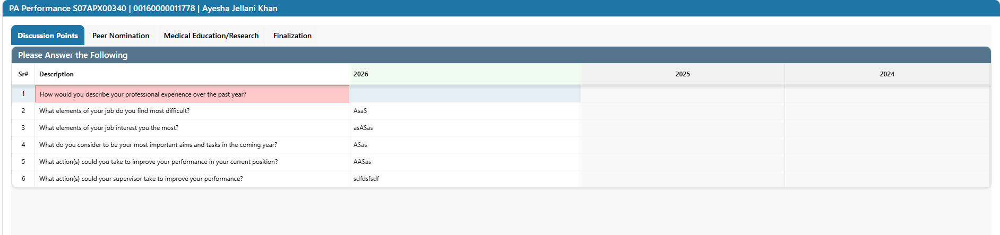
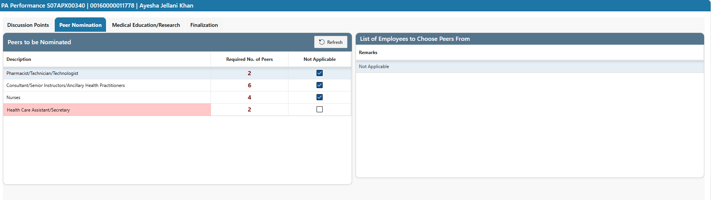

# HOPe PA Performance Survey – User Manual

## Purpose

This user manual explains the steps to complete the **HOPe PA Performance Survey** in the Hospital Management Information System (HMIS) under **Human Resources**. The survey is completed as part of the Performance Appraisal (360°) and consists of Discussion Points, Peer Nomination, Medical Education/Research and Finalization.

## Process

Once HR distributes the Performance Appraisal, the survey task appears in the user's Pending Queue. The user opens the task and lands on the **PA Performance** screen.

The screen title shows the appraisal number, the employee number and the employee name, for example:

`PA Performance <Appraisal No> | <Employee No> | <Employee Name>`

The survey screen consists of the following four tabs:

| Tab | Purpose |
|---|---|
| **Discussion Points** | Answer the discussion questions about the past year and the coming year. |
| **Peer Nomination** | Nominate the required number of peers from each category. |
| **Medical Education/Research** | Enter medical education and research details, where applicable. |
| **Finalization** | Review completion status, add remarks and forward the appraisal to the next stage. |

> Note: Depending on the appraisal type, additional tabs such as *Behavioral Assessment* and *Management Traits* may also be displayed.

---

## Discussion Points

By default, the **Discussion Points** tab is displayed when the survey is opened.

- The section **Please Answer the Following** lists the discussion questions in a grid with the columns **Sr#**, **Description**, and one column for each year (for example 2026, 2025 and 2024).
- The current year column (2026) is used to enter answers. Answers from previous years are shown for reference only.
- The following questions are displayed:
  1. How would you describe your professional experience over the past year?
  2. What elements of your job do you find most difficult?
  3. What elements of your job interest you the most?
  4. What do you consider to be your most important aims and tasks in the coming year?
  5. What action(s) could you take to improve your performance in your current position?
  6. What action(s) could your supervisor take to improve your performance?
- Click the current year cell of a question and type the answer.
- The row currently selected is highlighted. A row highlighted in **red** means the answer is still pending.
- Use **Save** to save the answers entered. Use **Reset** to reload the grid, discarding unsaved changes.
- The **Actions** menu and **Grid Settings** can be used to adjust the grid view (for example, columns displayed).

---

## Peer Nomination

Click the **Peer Nomination** tab to nominate peers.

The tab has two panels.

**Peers to be Nominated (left panel)**

- Displays each peer category (**Description**) and the **Required No. of Peers** to be nominated:

  | Category | Required No. of Peers |
  |---|---|
  | Pharmacist/Technician/Technologist | 2 |
  | Consultant/Senior Instructors/Ancillary Health Practitioners | 6 |
  | Nurses | 4 |
  | Health Care Assistant/Secretary | 2 |

- Select a category to view or nominate peers for it.
- If nominating peers is not required for a category, tick **Not Applicable**. The remarks area on the right can then be used to state the reason.
- A category highlighted in **red** means the nomination for that category is not yet complete.
- Click **Refresh** to reload the categories and update the status.

**List of Employees to Choose Peers From (right panel)**

- Displays the list for the selected category. Nominated peers are shown with **Name**, **Employee Code**, **Designation** and **Department**.
- Where peers are outside the organization, the list shows **Name**, **Contact Details** and **Email** instead.
- The **Remarks** field is used to enter comments, for example when *Not Applicable* is selected.
- Use **Delete** to remove a nominated peer if a change is required.
- Use **Save** to save the nominations.

---

## Medical Education/Research

Click the **Medical Education/Research** tab to provide medical education and research details, where applicable.

> [Screenshot: Medical Education/Research tab – to be added]

- Enter the required information in the fields displayed.
- Use **Save** to save the entered information.
- If nothing is applicable, follow the on-screen instructions or state this in the remarks.

---

## Finalization

The **Finalization** tab is used to complete the current stage of the survey and forward the appraisal.

> [Screenshot: Finalization tab – to be added]

- The **Appraisers' Remarks** section displays the name of the user and the message **Complete the item(s) below before forwarding to HR**.
- The checklist shows the status of **Discussion Points**, **Peer Nomination** and **Medical Education/Research**. All items must be completed before forwarding.
- Enter any comments in **Add your Remarks**.
- Click **To Previous Appraiser** to return the appraisal to the previous appraiser, if required.
- Click **Forward Appraisal to HR Department** to forward the appraisal. Once forwarded, it is removed from your Pending Queue and appears in the queue of the next stage.
- The **Preview** option can be used to preview the appraisal before proceeding.
- The **Save** option saves the entered or updated information.
- The **Exit** option closes the survey screen.

---

## Quick Checklist

1. Open the task from the Pending Queue.
2. Answer all questions in **Discussion Points** and click **Save**.
3. Nominate the required peers in **Peer Nomination** (or tick **Not Applicable**) and click **Save**.
4. Complete **Medical Education/Research**, if applicable.
5. Go to **Finalization**, confirm all items are complete, add remarks and forward.
