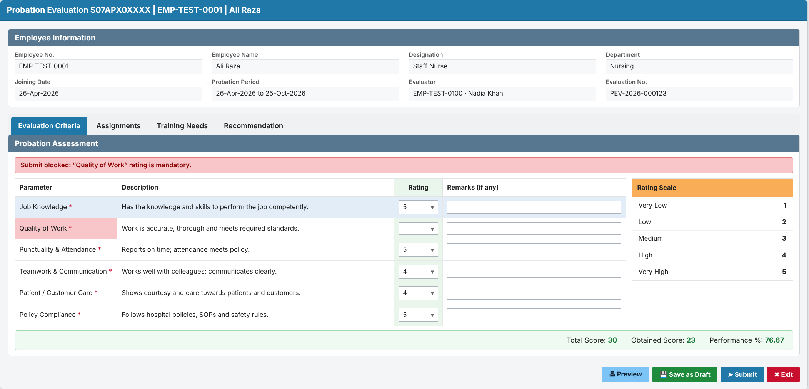
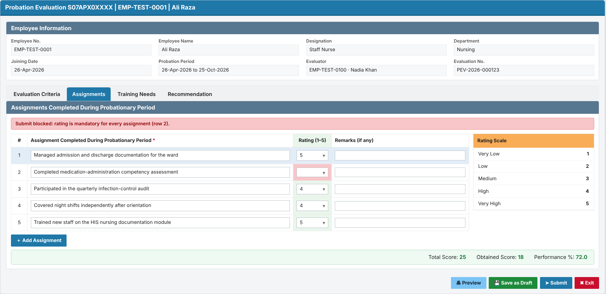
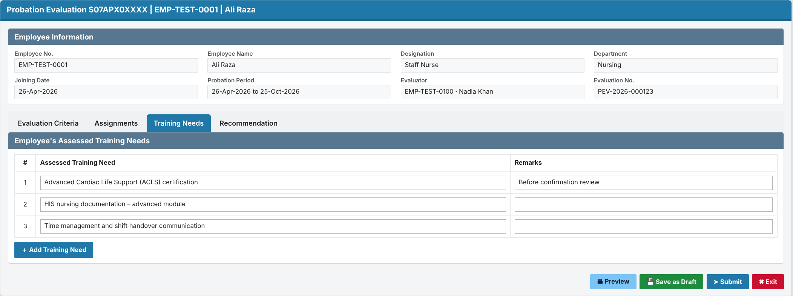
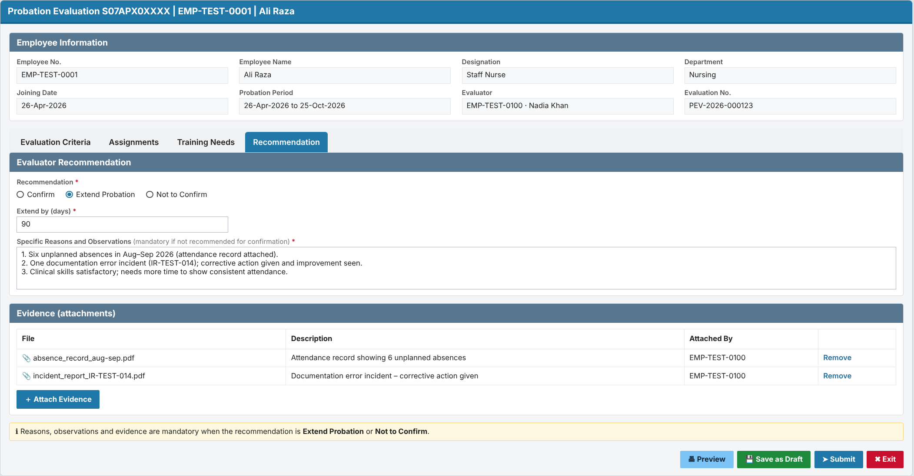
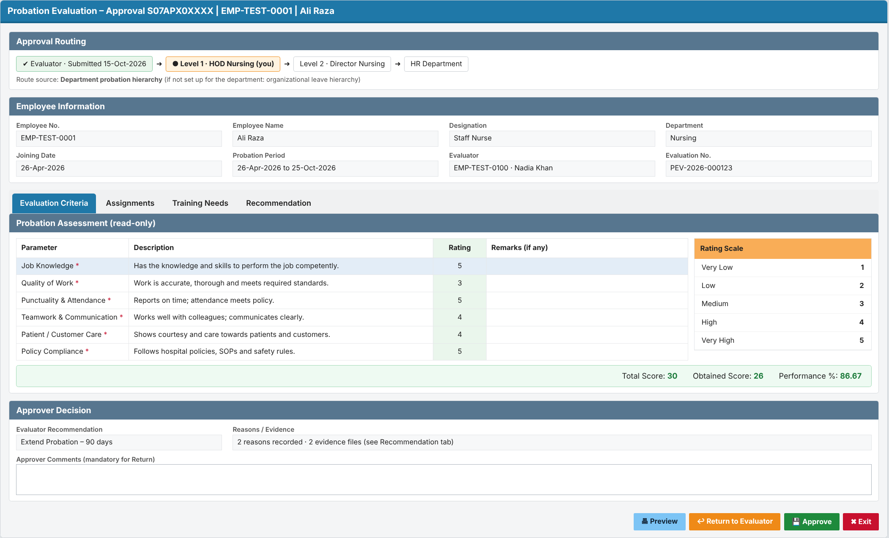
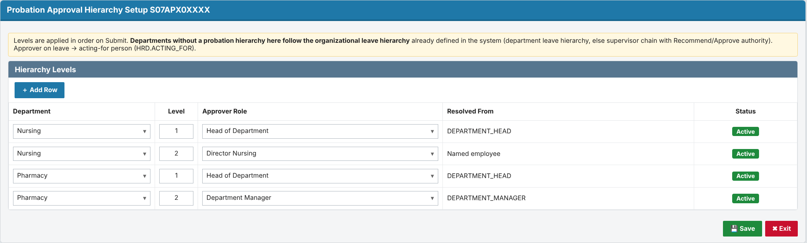
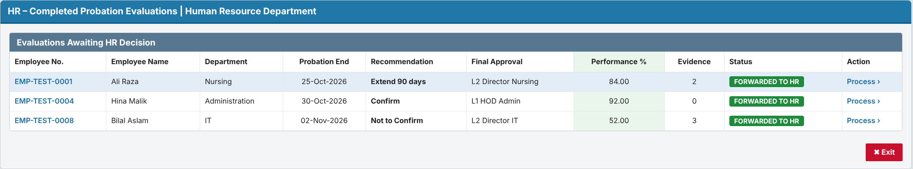
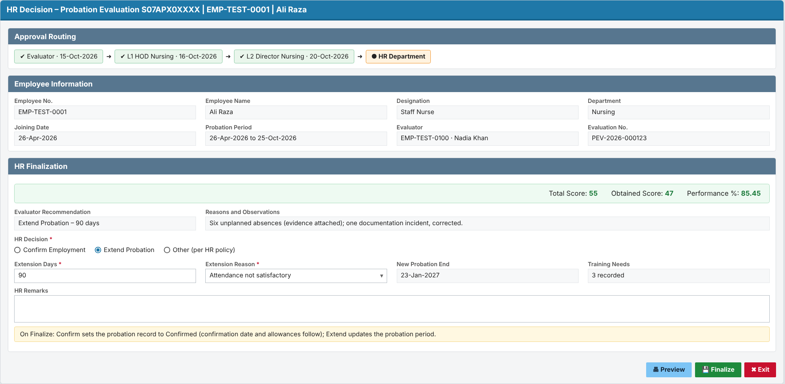

# Change Request: Automated Employee Probation Evaluation

| Item | Value |
|---|---|
| CR No. | CR-2026-XXX-PEV (placeholder) |
| Module | HR (HRD), Oracle APEX |
| Requested by | HR Department |
| Version / Status | 0.6 / DRAFT |
| Date | 09-Oct-2026 |

# 1. Client Needs / Expectations

HR wants the employee probation evaluation to run automatically, on time and with full visibility, without manual follow-up:

1. Every employee on probation is evaluated by their **respective supervisor** before the probation end date. The system starts the evaluation automatically **15 days before** the probation end date.
2. The evaluator can work on the evaluation over more than one sitting (**Save as Draft**) and send it when ready (**Submit for approval**).
3. Every submitted evaluation goes through the **approval hierarchy set up for the department** (for example HOD, then Director). If no hierarchy is set up for the department, it follows the **organizational leave hierarchy** already defined in the system.
4. Once approved, the completed evaluation reaches the **HR Department** automatically.
5. HR and supervisors can see the **current status** of every probation evaluation at any time. The status updates itself at each step.
6. The evaluation form has four sections (replacing today's Excel form):
   - **Evaluation criteria** (standard parameters such as job knowledge and quality of work), each rated **1 to 5**;
   - **Assignments completed during the probationary period**, each rated **1 to 5**;
   - **Employee's assessed training needs**;
   - **Specific reasons and observations, with evidence**, when the employee is **not recommended for confirmation**.

**Expected benefits:** no missed or late evaluations, a consistent approval path, no manual chasing by HR, and an audit trail of who did what and when.

**Today:** a probation-ending alert is e-mailed **15 or 30 days before** the probation end date with an **Excel probation evaluation form** attached. The concerned person fills in the Excel form and sends it back as feedback. In the HRD system, the alert is configured as alert 001 (`HRD.ALERTS` / `HRD.HR_ALERT_QUEUE`, visible to HR users only), and HR records the confirm/extend decision on form S07FRM00362. There is no online form, approval routing or status tracking.

# 2. Workflow

| Step | Actor | Action | System result | Status after step |
|---|---|---|---|---|
| 1 | System (daily job) | Finds employees whose probation end date is within 15 days and who have no evaluation yet | Creates an evaluation queue item for the respective supervisor and notifies them | Evaluation Pending |
| 2a | Supervisor (evaluator) | Fills part of the form and clicks **Save as Draft** | Saves; the item stays in the supervisor's queue | Draft |
| 2b | Supervisor | Completes the form and clicks **Submit** | Validates mandatory fields and routes to Level 1 | Pending Approval – Level 1 |
| 3a | Approver (Level n) | **Approve** | Moves to the next level | Pending Approval – Level n+1 |
| 3b | Approver | **Return** with comments | Back to the supervisor for correction | Returned |
| 4 | System | Last level approves | Routes to the HR Department queue | Forwarded to HR |
| 5 | HR | Processes the evaluation (confirm / extend, per HR policy) | Closes the evaluation and updates the probation record | Completed |

Status names are proposed and need HR to confirm them.

# 3. Functional Requirements

## Requirement 1: Automatic generation of the probation evaluation queue

**Description:** Every day, the system shall identify each employee on probation whose probation end date is within the next 15 days and who has no evaluation for the current probation period. For each one, it shall create a probation evaluation queue item assigned to the employee's respective supervisor.

- One evaluation only per employee per probation period. A re-run never creates a duplicate.
- If a day's run is missed, the next run picks up the employees that were missed.
- If the employee has no supervisor on record, the item goes to an **HR exception list**. HR can assign or reassign the evaluator.
- If the employee leaves (separation) before HR completes the evaluation, the evaluation is cancelled.
- The supervisor is notified by e-mail when an item is assigned.
- Probation end date: taken from the probation record (`HRD.F_PROBATION_END_DATE`). Respective supervisor: `HRD.INFORMATION.MANAGER_MRNO` (to be confirmed by HR).

**Acceptance (summary):**
- An employee whose probation ends on 25-Oct-2026 appears in their supervisor's queue on 10-Oct-2026.
- An employee whose probation ends on 26-Oct-2026 does not appear in the queue on 10-Oct-2026.
- An employee who has been confirmed or has left never appears in the queue.

### Prototype: Supervisor pending tasks (queue)

**Screen 1 – My Pending Tasks (supervisor)**

## Requirement 2: Evaluation entry with Save as Draft / Submit

**Description:** The system shall let the assigned evaluator open the evaluation from the queue and fill in the evaluation form.

- The form shows the employee's details: employee no., name, department, designation, joining date, probation start and end dates.
- **Save as Draft:** saves without validation and without routing. Only the evaluator can see a Draft.
- **Submit:** checks that all mandatory fields are filled. If any are missing, it blocks submission and highlights them. Otherwise it routes the evaluation to approval (Requirement 3).
- After Submit the form is **read-only** for the evaluator, unless an approver returns it.
- The form has four tabs: **Evaluation Criteria | Assignments | Training Needs | Recommendation**.
  - **Evaluation Criteria:** the standard parameters maintained by HR (e.g. Job Knowledge, Quality of Work, Punctuality & Attendance), each rated **1 to 5** with optional remarks, beside the Rating Scale panel and a score bar.
  - **Assignments:** the evaluator lists the assignments completed during the probationary period and rates each one from **1 (Very Low) to 5 (Very High)**, with optional remarks. The system calculates the total, obtained score and performance %.
  - **Training Needs:** the evaluator lists the employee's assessed training needs.
  - **Recommendation:** Confirm, Extend Probation (with days) or Not to Confirm. When the employee is **not recommended for confirmation** (Extend or Not to Confirm), the evaluator **must** enter the specific reasons and observations and attach the **evidence**.
- A warning appears if the user leaves the page with unsaved changes. If another user changed the evaluation after it was opened, the save is rejected with "Changed by another user, reload".

**Acceptance (summary):**
- A Draft is saved and reopens with all values intact.
- Submit with a mandatory field empty is refused, and the status does not change.
- Submit with an unrated mandatory criterion, without any assignment, with an unrated assignment, or (when not recommending confirmation) without reasons and evidence is refused.
- A user who is not the evaluator cannot open the form.

### Prototype: Probation Evaluation form (Evaluation Criteria, Assignments, Training Needs, Recommendation)

**Screen 2 – Evaluation Criteria tab: standard parameters rated 1–5**

**Screen 3 – Assignments tab: assignments completed during probation, rated 1–5**

**Screen 4 – Training Needs tab: employee's assessed training needs**

**Screen 5 – Recommendation tab: reasons, observations and evidence when not recommended**

## Requirement 3: Routing through the configured approval hierarchy

**Description:** On Submit, the system shall route the evaluation one level at a time in order:

- **If a probation approval hierarchy is set up for the employee's department**, it follows that hierarchy.
- **Otherwise it follows the organizational leave hierarchy** already defined in HRD, the same approvers who approve the employee's leave: the department leave hierarchy if one is defined, else the supervisor chain upwards until the final leave approver.
- The screen shows which route source is used.

- **Approve** (optional comments): moves the evaluation to the next level.
- **Return** (comments mandatory): sends it back to the evaluator (status Returned). The evaluator corrects it and re-submits.
- No one approves their own case. If the evaluator is also the approver at a level, that level is skipped and the reason is logged. If there is no next level, the evaluation goes to the HR exception list.
- If an approver's level cannot be resolved, the evaluation goes to the HR exception list. It is never lost.
- **Approver on leave:** the evaluation goes to their acting-for person (`HRD.ACTING_FOR`), to be confirmed by HR.
- The hierarchy levels (for example L1 = HOD, L2 = Director, by department or grade) are maintained by the HR Administrator. **The levels are pending from HR.**
- **Approach (decided):** dedicated probation tables: hierarchy levels in `HRD_PROBATION_HIERARCHY_MST`, per-level actions in `HRD_PROBATION_APPROVAL_TRN` (see the Design Document). Approver on leave → acting-for person from `HRD.ACTING_FOR`.

**Acceptance (summary):**
- After Level 1 approves, the evaluation appears in the Level 2 queue and leaves the Level 1 queue.
- A Return without comments is refused.
- The evaluated employee never receives their own evaluation in their queue.

### Prototype: Approver screen and hierarchy setup

**Screen 6 – Approval view (Approve / Return to Evaluator)**

**Screen 7 – Probation Approval Hierarchy Setup (HR Administrator)**

## Requirement 4: Automatic routing of the completed evaluation to HR

**Description:** When the last approval level approves, the system shall route the completed evaluation to the HR Department queue automatically. HR shall be able to process it and close it.

- HR sees the complete evaluation, the recommendation and the full approval trail.
- HR records the outcome (Confirm / Extend, per HR policy) and closes the evaluation (status Completed).
- **Important (from the HRD code):** the probation record (`HRD.EMPLOYEE_PROBATION_HISTORY.PROBATION_STATUS`) is set to **Confirmed ('C') only at this HR step**. Setting 'C' automatically:
  - sets `HRD.INFORMATION.CONFIRMATION_DATE`;
  - creates incentive/allowance queue entries;
  - clears the HR probation alert.
- An extension updates the probation period instead (reason from `HRD.PROBATION_REASONS`).
- **To be confirmed with HR:**
  - Does "after submission" mean after final approval (assumed here), or should HR see it as soon as the supervisor submits?
  - Does this replace the current alert 001 / form S07FRM00362 process?

**Acceptance (summary):**
- After the last-level approval, the evaluation appears in the HR queue with status Forwarded to HR.
- HR cannot process an evaluation that is still pending approval.
- Confirmation date and incentives change only after HR confirms.

### Prototype: HR queue and decision

**Screen 8 – HR queue of completed evaluations**

**Screen 9 – HR Finalization (Confirm / Extend)**

## Requirement 5: Automatic status update throughout the workflow

**Description:** The system shall update the evaluation / probation request status automatically at every workflow event. Users cannot edit the status by hand. Every change is kept in an insert-only history.

- Status values (proposed): Evaluation Pending → Draft → Pending Approval – Level n → Returned → Forwarded to HR → Completed, plus Cancelled.
- History records the old status, new status, action, comments, user and date-time.
- HR has a **monitoring screen** of all evaluations, with filters by status, department, evaluator and end date. It flags evaluations as **overdue** when they are not with HR by the probation end date.
- Supervisors and approvers see the status of their own items.

**Acceptance (summary):**
- Submitting a Draft changes the status to Pending Approval – Level 1 with no manual step.
- The history shows each step in time order.
- No user can edit or delete history.

### Prototype: Monitoring and status history

**Screen 10 – Probation Evaluation Monitoring and status history (HR)**

