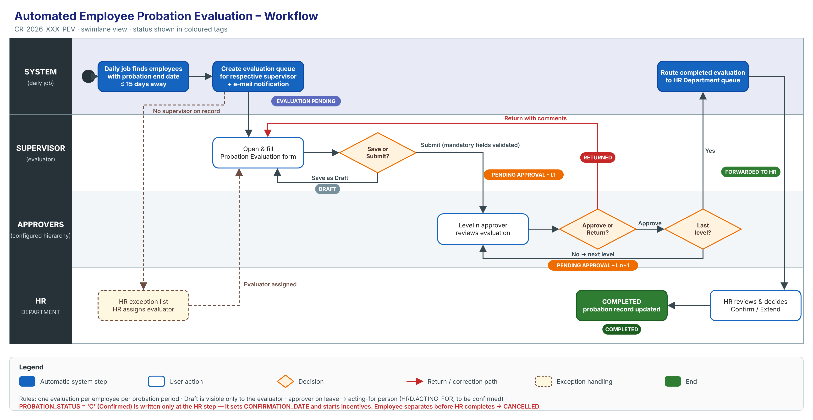
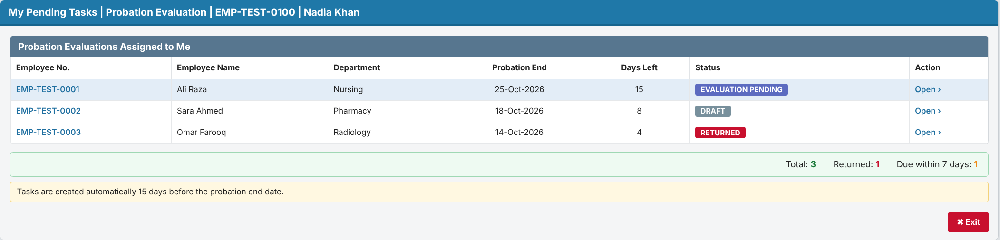
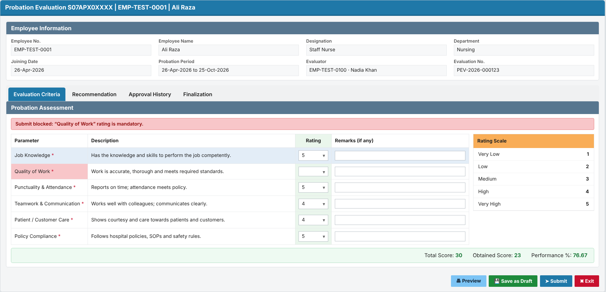
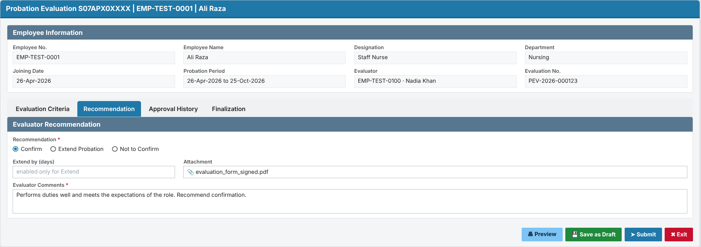
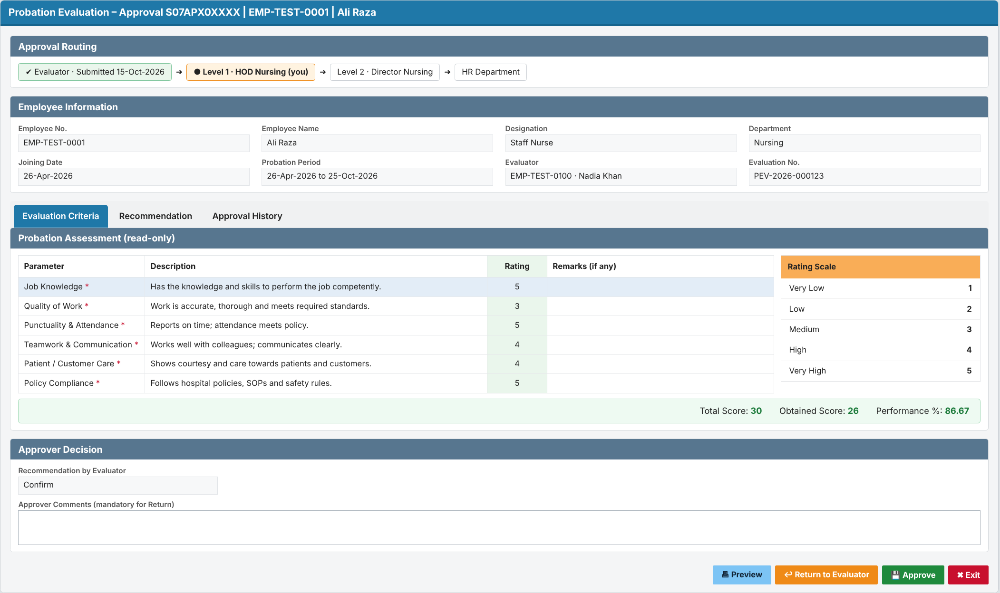
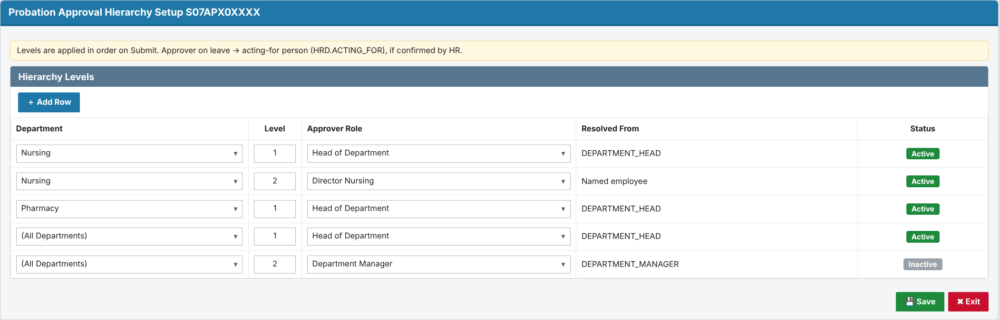
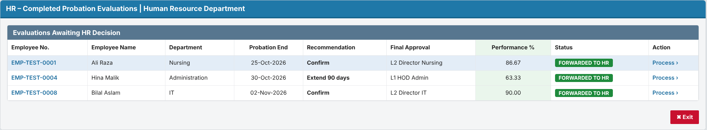
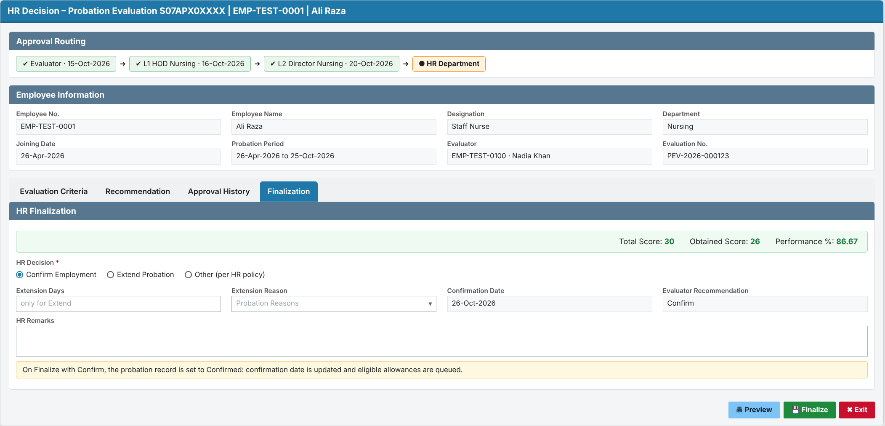
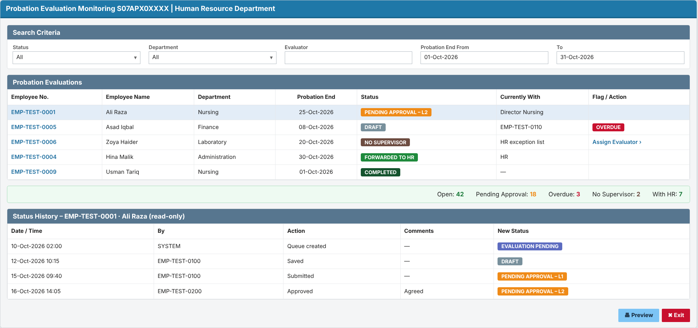

# Change Request: Automated Employee Probation Evaluation

| Item | Value |
|---|---|
| CR No. | CR-2026-XXX-PEV (placeholder: real CR number to be assigned) |
| Module / Schema | HR (HRD), Oracle APEX |
| Requested by | HR Department |
| Prepared by | Claude (AI draft) for Business Analyst |
| Version / Status | 0.4 / DRAFT (final client CR template) |
| Date | 09-Oct-2026 |
| Sources merged | CR-2026-XXX-PEV_CR_v0.1 (client template) + CR-2026-XXX-PEV_SRS_v0.3 (detailed requirements, impact analysis). SA review: CR-2026-XXX-PEV_SRS-Review_v2 |

> Open-question (Q-NN) and assumption (A-NN) references point to the internal SRS (`CR-2026-XXX-PEV_SRS_v0.3`); they are not repeated in this CR. Table and column details: `CR-2026-XXX-PEV_DD_v0.1` (Data Dictionary & DB Structure).

# 1. Client Needs / Expectations

HR wants the employee probation evaluation to run automatically, on time and with full visibility, without manual follow-up:

1. Every employee on probation is evaluated by their **respective supervisor** before the probation end date. The system starts the evaluation automatically **15 days before** the probation end date.
2. The evaluator can work on the evaluation over more than one sitting (**Save as Draft**) and send it when ready (**Submit for approval**).
3. Every submitted evaluation goes through the **configured approval hierarchy** (for example HOD, then Director).
4. Once approved, the completed evaluation reaches the **HR Department** automatically.
5. HR and supervisors can see the **current status** of every probation evaluation at any time. The status updates itself at each step.

**Expected benefits:** no missed or late evaluations, a consistent approval path, no manual chasing by HR, and an audit trail of who did what and when.

**Today (from the HRD system):** probation-expiry alerts (alert 001, `HRD.HR_ALERT_QUEUE`) go to **HR users only**, and HR records the confirm/extend decision on form S07FRM00362. Supervisors have no system task, and the evaluation is not routed through approvals.

## 1.1 Business requirements

| ID | Business requirement | Source (M-NN) | Priority |
|---|---|---|---|
| BR-01 | Every employee on probation shall be evaluated by their supervisor before the probation end date, with the evaluation started automatically in good time. | M-01, M-02, M-03 | Must |
| BR-02 | Evaluators shall be able to work on an evaluation over more than one session before committing it. | M-04, M-05 | Must |
| BR-03 | Every submitted evaluation shall be reviewed through the organisation's configured approval hierarchy. | M-06 | Must |
| BR-04 | HR shall receive every completed evaluation without manual follow-up. | M-07 | Must |
| BR-05 | HR and supervisors shall always know the current stage of each probation evaluation. | M-08 | Must |

## 1.2 Background

Employees joining SKMCH serve a probation period. Before the probation end date, the employee's supervisor must evaluate the employee so that HR can decide on confirmation. The requested change automates this: the system starts the evaluation on time, routes it through the approval hierarchy and delivers it to HR, while keeping the probation request status current at every step (M-01 to M-08). How the process is run today (manual forms, e-mail or an existing screen) was not described in the request (Q-02).

## 1.3 Current process (As-Is)

The request does not describe the current process (Q-02). The HRD schema (v0.3) shows existing probation objects: a probation period record with status (`HRD.EMPLOYEE_PROBATION_HISTORY`), a probation-expiry pending task (`PKG_PENDING_TASKS.PROBATION_EXPIRE_QUEUE`) and an evaluation alert/confirmation queue with Completed / Extend / Pending / In-process statuses (`HRD.EVALUATION_ALERT_QUEUE`). Today's process probably uses these, which HR/IT need to confirm (Q-24). Based on the requested changes, the following is assumed (A-01):

1. HR tracks probation end dates and asks supervisors to evaluate employees, manually or by a non-automated means.
2. Supervisors complete the evaluation outside a system workflow (or on a screen without approval routing) and send it to HR.
3. Approval by higher levels (if any) is obtained manually.
4. Probation request status, if a probation request record exists, is updated manually by HR.

Pain points implied by the request: evaluations started late or missed, no consistent approval path, no automatic hand-over to HR, and status that does not reflect where the evaluation actually is.

## 1.4 Scope

### In scope

- Automatic generation of a probation evaluation queue item for the respective supervisor 15 days before the employee's probation end date (M-02, M-03).
- Evaluation entry by the evaluator with Save as Draft and Submit for approval (M-04, M-05).
- Routing of a submitted evaluation through the configured approval hierarchy (M-06).
- Automatic routing of the completed evaluation to the HR Department (M-07).
- Automatic update of the probation request status throughout the workflow, with status history (M-08).

### Out of scope

- HR's downstream action on the evaluation (confirmation letter, probation extension, termination, payroll/grade changes). Not discussed; HR's exact action on receipt is open (Q-06).
- Design of the evaluation form content (criteria, rating scale, recommendation values). Not provided in the request; to be supplied by HR (Q-05). The workflow is in scope; the form content is a dependency.
- Probation evaluation of employees whose probation is ended early (resignation, termination) — the queue is cancelled only (see FR-004); no separate process is specified.
- Self-evaluation by the employee. Not mentioned.
- Automatic confirmation, extension or termination of probation, including when an evaluation is overdue (changed in v0.2, RV-17).

## 1.5 Stakeholders

| Name / Role | Department | Interest / responsibility | Attended meeting |
|---|---|---|---|
| HR Department representative(s) (names not stated, Q-13) | HR | Business owner; receives completed evaluations; owns probation policy | Not stated |
| Supervisors / evaluators | All departments | Complete probation evaluations on time | No |
| Approvers in the approval hierarchy (e.g. HOD) | All departments | Review and approve submitted evaluations | No |
| Employees on probation | All departments | Subject of the evaluation (no system action) | No |
| Business Analyst | IT / Development | Requirement owner for this SRS | Not stated |
| Solution Architect | IT | SRS review and approval (Gate 1) | Not stated |
| Development team / QA | IT | Build and test | Not stated |

## 1.6 Definitions and abbreviations

| Term | Meaning |
|---|---|
| Probation end date | The date on which the employee's probation period ends, as held in the employee's HR record |
| Probation request | The HR record that tracks an employee's probation period and its evaluation outcome (whether this already exists in HRD is to be confirmed, Q-03) |
| Probation request status | The HR-level status of the employee's probation period, updated automatically from the evaluation workflow (changed in v0.2, RV-04; mapping to be finalised with Q-03, Q-09) |
| Evaluation status | The workflow status of a probation evaluation, with the values and transitions in RULE-08 (added in v0.2, RV-04) |
| Probation evaluation | The assessment of an employee on probation, completed by the evaluator and approved through the hierarchy |
| Evaluator | The respective supervisor of the employee, who completes the evaluation |
| Respective supervisor | The employee's direct supervisor / reporting manager on record (source to be confirmed, Q-04) |
| Queue | A pending work item shown to a user on their queue / inbox screen |
| Approval hierarchy | The configured ordered list of approval levels a submitted evaluation passes through |
| Draft | A saved but not submitted evaluation, visible and editable only by the evaluator |
| HOD | Head of Department |
| APEX | Oracle Application Express, the platform for the HRD applications |
| MoM | Minutes of Meeting |

## 1.7 References

- Request: "Automated Employee Probation Evaluation", proposed workflow points 1 to 5 (shared in chat, 2026-10-09). Meeting date and attendees not stated (Q-13).
- Earlier SRS versions: none.
- Related CRs: none known. CR number to be assigned (Q-14). Placeholder `CR-2026-XXX-PEV` used because `CR-2026-XXX` is already used by the Committee Workflow CR.
- HR probation policy / SOP: to be supplied by HR (Q-05, Q-08).

# 2. Workflow

*Editable source: `CR-2026-XXX-PEV_Workflow.svg`.*

| Step | Actor | Action | System result | Status after step |
|---|---|---|---|---|
| 1 | System (daily job) | Finds employees whose probation end date is within 15 days and who have no evaluation yet | Creates an evaluation queue item for the respective supervisor and notifies them | Evaluation Pending |
| 2a | Supervisor (evaluator) | Fills part of the form and clicks **Save as Draft** | Saves; the item stays in the supervisor's queue | Draft |
| 2b | Supervisor | Completes the form and clicks **Submit** | Validates mandatory fields and routes to Level 1 | Pending Approval – Level 1 |
| 3a | Approver (Level n) | **Approve** | Moves to the next level | Pending Approval – Level n+1 |
| 3b | Approver | **Return** with comments | Back to the supervisor for correction | Returned |
| 4 | System | Last level approves | Routes to the HR Department queue | Forwarded to HR |
| 5 | HR | Processes the evaluation (confirm / extend, per HR policy) | Closes the evaluation and updates the probation record | Completed |

Status names are proposed and need HR to confirm them.

## 2.1 Status model

Allowed statuses and transitions are defined in RULE-08 (section 4.1 below).

# 3. Functional Requirements

Each requirement below follows the client template: a summary, a GUI prototype (screen mock-up in the SKMCH APEX GUI template — title bar with page code, tabs, region headers, rating-scale panel, score bar, Preview/Save/Exit buttons; sample data is synthetic and form content is indicative until HR supplies the evaluation form) and the detailed functional requirements (FR-NNN) with acceptance criteria. Editable prototype sources: `prototypes/src/`.

## 3.1 Requirement 1: Automatic generation of the probation evaluation queue

**Description:** Every day, the system shall identify each employee on probation whose probation end date is within the next 15 days and who has no evaluation for the current probation period. For each one, it shall create a probation evaluation queue item assigned to the employee's respective supervisor.

- One evaluation only per employee per probation period. A re-run never creates a duplicate.
- If a day's run is missed, the next run picks up the employees that were missed.
- If the employee has no supervisor on record, the item goes to an **HR exception list**. HR can assign or reassign the evaluator.
- If the employee leaves (separation) before HR completes the evaluation, the evaluation is cancelled.
- The supervisor is notified by e-mail when an item is assigned.
- Probation end date: taken from the probation record (`HRD.F_PROBATION_END_DATE`). Respective supervisor: `HRD.INFORMATION.MANAGER_MRNO` (to be confirmed by HR).

**Acceptance (summary):**
- An employee whose probation ends on 25-Oct-2026 appears in their supervisor's queue on 10-Oct-2026.
- An employee whose probation ends on 26-Oct-2026 does not appear in the queue on 10-Oct-2026.
- An employee who has been confirmed or has left never appears in the queue.

*Traceability: FR-001 – FR-006, RULE-01 – RULE-03.*

### 3.1.1 Prototype (GUI): Supervisor pending tasks (queue)

**Screen 1 – My Pending Tasks (supervisor)**

### 3.1.2 Detailed functional requirements

#### FR-001 Identify employees due for evaluation

**Description:** The system shall, once every day, identify each employee on probation whose probation end date is on or before 15 calendar days after the current date, is not earlier than the current date, and who has no evaluation for the current probation period (changed in v0.2, RV-05).
**Priority:** Must
**Source:** M-02
**Business rules:** RULE-01, RULE-03
**Acceptance criteria:**
- AC1: Given an employee on probation with a probation end date of 25-Oct-2026, when the daily process runs on 10-Oct-2026, then the employee is identified as due for evaluation.
- AC2 (negative): Given an employee on probation with a probation end date of 26-Oct-2026, when the daily process runs on 10-Oct-2026, then the employee is not identified.
- AC3 (negative): Given an employee who is not on probation (confirmed or separated), when the daily process runs, then the employee is not identified regardless of dates.
- AC4 (catch-up): Given the daily process did not run on 10-Oct-2026 and an employee's probation end date is 25-Oct-2026 with no evaluation, when the process runs on 12-Oct-2026, then the employee is identified.
**Notes / open questions:** Q-01 (calendar vs working days), Q-10 (catch-up for missed runs and go-live backlog).

#### FR-002 Generate evaluation queue item for respective supervisor

**Description:** The system shall create a probation evaluation queue item, assigned to the employee's respective supervisor, for each employee identified by FR-001.
**Priority:** Must
**Source:** M-02, M-03
**Business rules:** RULE-02, RULE-03
**Acceptance criteria:**
- AC1: Given employee EMP-TEST-0001 is identified and their supervisor on record is EMP-TEST-0100, when the daily process completes, then a probation evaluation queue item for EMP-TEST-0001 appears in EMP-TEST-0100's queue.
- AC2 (negative): Given employee EMP-TEST-0001 is identified, when the daily process completes, then no other user except the assigned supervisor (and HR monitoring, FR-017) sees the queue item.
**Notes / open questions:** Q-04 (source of "respective supervisor").

#### FR-003 Prevent duplicate evaluation queue items

**Description:** The system shall create no more than one active probation evaluation for the same employee and probation period.
**Priority:** Must
**Source:** M-02 (Inferred)
**Business rules:** RULE-03
**Acceptance criteria:**
- AC1: Given a queue item already exists for EMP-TEST-0001's current probation period, when the daily process runs again (e.g. re-run of the same day), then no second queue item is created.
- AC2: Given an employee's probation period is extended by HR with a new end date, when the new trigger date is reached, then a new evaluation is created for the new period (subject to Q-08).
**Notes / open questions:** Q-08 (probation extension).

#### FR-004 Cancel evaluation when probation ends early

**Description:** The system shall cancel an open probation evaluation and remove it from all queues when the employee is no longer on probation (separation or early confirmation) before the evaluation is completed.
**Priority:** Should
**Source:** M-08 (Inferred)
**Business rules:** RULE-08
**Acceptance criteria:**
- AC1: Given an evaluation in Draft for EMP-TEST-0002, when HR records EMP-TEST-0002's separation, then the evaluation status becomes Cancelled and it disappears from the supervisor's queue.
- AC2 (negative): Given an evaluation already Forwarded to HR, when the employee separates, then the evaluation is not cancelled automatically and remains with HR.
**Notes / open questions:** Q-11.

#### FR-005 Handle missing supervisor

**Description:** The system shall, when an identified employee has no respective supervisor on record, create the evaluation unassigned and show it on an HR exception list instead of a supervisor queue.
**Priority:** Must
**Source:** M-03 (Inferred)
**Business rules:** RULE-02
**Acceptance criteria:**
- AC1: Given an identified employee with no supervisor on record, when the daily process runs, then the evaluation appears on the HR exception list with the reason "Supervisor not defined".
- AC2: Given an evaluation on the HR exception list, when an HR Administrator assigns an evaluator using FR-006, then the queue item moves to that evaluator's queue.
- AC3 (negative): Given an identified employee with no supervisor, when the daily process runs, then the process does not fail and continues for the other employees.
**Notes / open questions:** Q-04.

#### FR-006 Reassign evaluator

**Description:** The system shall allow an HR Administrator to assign or reassign an evaluation that is unassigned or not yet submitted to a different evaluator (changed in v0.2, RV-15).
**Priority:** Should
**Source:** M-03 (Inferred)
**Business rules:** RULE-02
**Acceptance criteria:**
- AC1: Given an evaluation in Evaluation Pending or Draft, when an HR Administrator reassigns it to EMP-TEST-0101, then it leaves the old supervisor's queue and appears in EMP-TEST-0101's queue with any draft content kept.
- AC2 (negative): Given an evaluation in Pending Approval, when an HR Administrator tries to reassign the evaluator, then the action is not available.
**Notes / open questions:** Q-12 (supervisor change after queue generation).

## 3.2 Requirement 2: Evaluation entry with Save as Draft / Submit

**Description:** The system shall let the assigned evaluator open the evaluation from the queue and fill in the evaluation form.

- The form shows the employee's details: employee no., name, department, designation, joining date, probation start and end dates.
- **Save as Draft:** saves without validation and without routing. Only the evaluator can see a Draft.
- **Submit:** checks that all mandatory fields are filled. If any are missing, it blocks submission and highlights them. Otherwise it routes the evaluation to approval (Requirement 3).
- After Submit the form is **read-only** for the evaluator, unless an approver returns it.
- The form content (criteria, rating scale and recommendation values such as Confirm / Extend / Terminate) comes from HR's form design (**pending from HR**).
- A warning appears if the user leaves the page with unsaved changes. If another user changed the evaluation after it was opened, the save is rejected with "Changed by another user, reload".

**Acceptance (summary):**
- A Draft is saved and reopens with all values intact.
- Submit with a mandatory field empty is refused, and the status does not change.
- A user who is not the evaluator cannot open the form.

*Traceability: FR-007 – FR-010, RULE-04, RULE-05.*

### 3.2.1 Prototype (GUI): Probation Evaluation form

**Screen 2 – Probation Evaluation: Evaluation Criteria tab (Save as Draft / Submit)**

**Screen 3 – Probation Evaluation: Recommendation tab**

### 3.2.2 Detailed functional requirements

#### FR-007 Open evaluation from queue

**Description:** The system shall allow the assigned evaluator to open a probation evaluation from their queue showing the employee's basic details (employee number, name, department, designation, joining date, probation end date) and the evaluation form.
**Priority:** Must
**Source:** M-02, M-03
**Business rules:** -
**Acceptance criteria:**
- AC1: Given a queue item assigned to the evaluator, when they open it, then the employee details and the evaluation form are shown.
- AC2 (negative): Given a user who is not the assigned evaluator, when they try to open the evaluation by URL, then access is denied.
**Notes / open questions:** Q-05 (form content).

#### FR-008 Save evaluation as Draft

**Description:** The system shall allow the evaluator to save a partially or fully completed evaluation as Draft without routing it, and to reopen and edit it later.
**Priority:** Must
**Source:** M-04
**Business rules:** RULE-04, RULE-05
**Acceptance criteria:**
- AC1: Given an evaluation with some fields filled, when the evaluator clicks Save as Draft, then the entries are saved, the status becomes Draft, and the item stays in the evaluator's queue.
- AC2: Given an evaluation in Draft, when the evaluator reopens it, then all previously saved values are shown and editable.
- AC3 (negative): Given an evaluation in Draft, when any approver or HR user looks at their queue, then the evaluation is not there.
**Notes / open questions:** -

#### FR-009 Submit evaluation for approval

**Description:** The system shall allow the evaluator to submit a completed evaluation for approval after validating that all mandatory fields are filled.
**Priority:** Must
**Source:** M-05
**Business rules:** RULE-05
**Acceptance criteria:**
- AC1: Given an evaluation with all mandatory fields filled, when the evaluator clicks Submit and confirms, then the evaluation is submitted and FR-011 routing starts.
- AC2 (negative): Given an evaluation with a mandatory field empty, when the evaluator clicks Submit, then submission is refused, the missing fields are highlighted, and the status is unchanged.
**Notes / open questions:** Q-05.

#### FR-010 Lock submitted evaluation

**Description:** The system shall prevent the evaluator from changing a submitted evaluation unless it has been returned to them.
**Priority:** Must
**Source:** M-05 (Inferred)
**Business rules:** RULE-08
**Acceptance criteria:**
- AC1: Given a submitted evaluation, when the evaluator opens it, then it is read-only.
- AC2: Given an evaluation returned by an approver, when the evaluator opens it, then it is editable again and can be re-submitted.
**Notes / open questions:** Q-07.

## 3.3 Requirement 3: Routing through the configured approval hierarchy

**Description:** On Submit, the system shall route the evaluation to the approval hierarchy configured for probation evaluations, one level at a time in order.

- **Approve** (optional comments): moves the evaluation to the next level.
- **Return** (comments mandatory): sends it back to the evaluator (status Returned). The evaluator corrects it and re-submits.
- No one approves their own case. If the evaluator is also the approver at a level, that level is skipped and the reason is logged. If there is no next level, the evaluation goes to the HR exception list.
- If an approver's level cannot be resolved, the evaluation goes to the HR exception list. It is never lost.
- **Approver on leave:** the evaluation goes to their acting-for person (`HRD.ACTING_FOR`), to be confirmed by HR.
- The hierarchy levels (for example L1 = HOD, L2 = Director, by department or grade) are maintained by the HR Administrator. **The levels are pending from HR.**
- **Approach (decided):** dedicated probation tables: hierarchy levels in `HRD_PROBATION_HIERARCHY_MST`, per-level actions in `HRD_PROBATION_APPROVAL_TRN` (see the DD document). Approver on leave → acting-for person from `HRD.ACTING_FOR`.

**Acceptance (summary):**
- After Level 1 approves, the evaluation appears in the Level 2 queue and leaves the Level 1 queue.
- A Return without comments is refused.
- The evaluated employee never receives their own evaluation in their queue.

*Traceability: FR-011 – FR-014, RULE-06, RULE-09.*

### 3.3.1 Prototype (GUI): Approver screen and hierarchy setup

**Screen 4 – Approval view (Approve / Return to Evaluator)**

**Screen 5 – Probation Approval Hierarchy Setup (HR Administrator)**

### 3.3.2 Detailed functional requirements

#### FR-011 Route to configured approval hierarchy

**Description:** The system shall route a submitted evaluation to the first level of the approval hierarchy configured for probation evaluations, resolving the approver for that level from the evaluated employee's department as on the submission date (changed in v0.2, RV-12; pending Q-16).
**Priority:** Must
**Source:** M-06
**Business rules:** RULE-06, RULE-09
**Acceptance criteria:**
- AC1: Given a configured hierarchy of Level 1 = HOD and Level 2 = Director, when an evaluation for an employee in Department D-TEST is submitted, then it appears in the D-TEST HOD's approval queue and the status shows Pending Approval – Level 1.
- AC2 (negative): Given a hierarchy level whose approver cannot be resolved, when the evaluation reaches that level, then it is placed on the HR exception list with the reason "Approver not defined for level n" and is not lost.
**Notes / open questions:** Q-15 (is there an existing approval hierarchy setup), Q-16 (hierarchy basis).

#### FR-012 Approve at a level

**Description:** The system shall allow the approver at the current level to approve the evaluation, with optional comments, and move it to the next configured level.
**Priority:** Must
**Source:** M-06
**Business rules:** RULE-06
**Acceptance criteria:**
- AC1: Given an evaluation at Level 1 of a 2-level hierarchy, when the Level 1 approver approves, then it moves to the Level 2 approver's queue and leaves the Level 1 queue.
- AC2 (negative): Given an evaluation at Level 2, when the Level 1 approver tries to approve it again, then the action is not available.
**Notes / open questions:** -

#### FR-013 Return evaluation to evaluator

**Description:** The system shall allow an approver to return an evaluation to the evaluator with mandatory comments.
**Priority:** Should
**Source:** M-06 (Inferred)
**Business rules:** RULE-08
**Acceptance criteria:**
- AC1: Given an evaluation at any level, when the approver returns it with comments, then the status becomes Returned and it appears in the evaluator's queue with the comments shown.
- AC2 (negative): Given the approver leaves the comments empty, when they click Return, then the action is refused.
**Notes / open questions:** Q-07 (return vs reject, and where a re-submission restarts).

#### FR-014 Prevent self-approval

**Description:** The system shall prevent a user from approving an evaluation in which they are the evaluated employee or the evaluator.
**Priority:** Must
**Source:** M-06 (Inferred)
**Business rules:** RULE-09
**Acceptance criteria:**
- AC1: Given the evaluator is also the resolved Level 1 approver, when the evaluation is submitted, then it moves to the next level and the history records "Skipped: approver is evaluator". If there is no next level, it is placed on the HR exception list (changed in v0.2, RV-06).
- AC2 (negative): Given the evaluated employee is a resolved approver, when routing runs, then the evaluation is never placed in that employee's queue.
**Notes / open questions:** Q-16.

## 3.4 Requirement 4: Automatic routing of the completed evaluation to HR

**Description:** When the last approval level approves, the system shall route the completed evaluation to the HR Department queue automatically. HR shall be able to process it and close it.

- HR sees the complete evaluation, the recommendation and the full approval trail.
- HR records the outcome (Confirm / Extend, per HR policy) and closes the evaluation (status Completed).
- **Important (from the HRD code):** the probation record (`HRD.EMPLOYEE_PROBATION_HISTORY.PROBATION_STATUS`) is set to **Confirmed ('C') only at this HR step**. Setting 'C' automatically:
  - sets `HRD.INFORMATION.CONFIRMATION_DATE`;
  - creates incentive/allowance queue entries;
  - clears the HR probation alert.
- An extension updates the probation period instead (reason from `HRD.PROBATION_REASONS`).
- **To be confirmed with HR:**
  - Does "after submission" mean after final approval (assumed here), or should HR see it as soon as the supervisor submits?
  - Does this replace the current alert 001 / form S07FRM00362 process?

**Acceptance (summary):**
- After the last-level approval, the evaluation appears in the HR queue with status Forwarded to HR.
- HR cannot process an evaluation that is still pending approval.
- Confirmation date and incentives change only after HR confirms.

*Traceability: FR-015, FR-016, RULE-07, IMP-15, IMP-34.*

### 3.4.1 Prototype (GUI): HR queue and decision

**Screen 6 – HR queue of completed evaluations**

**Screen 7 – HR Finalization (Confirm / Extend)**

### 3.4.2 Detailed functional requirements

#### FR-015 Forward completed evaluation to HR

**Description:** The system shall automatically route the evaluation to the HR Department queue when the last level of the approval hierarchy approves it.
**Priority:** Must
**Source:** M-07
**Business rules:** RULE-07
**Acceptance criteria:**
- AC1: Given an evaluation at the last configured level, when that approver approves, then the evaluation appears in the HR Department queue and the status becomes Forwarded to HR.
- AC2 (negative): Given an evaluation still at an intermediate level, when HR views its queue, then the evaluation is not in HR's actionable queue (only on the monitoring view, FR-017).
**Notes / open questions:** Q-06, Q-17 ("after submission" timing).

#### FR-016 HR closes evaluation

**Description:** The system shall allow an HR user to mark a forwarded evaluation as processed, which completes the evaluation.
**Priority:** Must
**Source:** M-07, M-08
**Business rules:** RULE-08
**Acceptance criteria:**
- AC1: Given an evaluation Forwarded to HR, when an HR user marks it as processed, then the status becomes Completed and it leaves the HR queue.
- AC2 (negative): Given an evaluation in Pending Approval, when an HR user tries to mark it processed, then the action is not available.
**Notes / open questions:** Q-06 (HR actions and outcome values).

## 3.5 Requirement 5: Automatic status update throughout the workflow

**Description:** The system shall update the evaluation / probation request status automatically at every workflow event. Users cannot edit the status by hand. Every change is kept in an insert-only history.

- Status values (proposed): Evaluation Pending → Draft → Pending Approval – Level n → Returned → Forwarded to HR → Completed, plus Cancelled.
- History records the old status, new status, action, comments, user and date-time.
- HR has a **monitoring screen** of all evaluations, with filters by status, department, evaluator and end date. It flags evaluations as **overdue** when they are not with HR by the probation end date.
- Supervisors and approvers see the status of their own items.

**Acceptance (summary):**
- Submitting a Draft changes the status to Pending Approval – Level 1 with no manual step.
- The history shows each step in time order.
- No user can edit or delete history.

*Traceability: FR-017 – FR-020, RULE-08, RULE-10.*

### 3.5.1 Prototype (GUI): Monitoring and status history

**Screen 8 – Probation Evaluation Monitoring and status history (HR)**

### 3.5.2 Detailed functional requirements

#### FR-017 Automatic probation request status update

**Description:** The system shall update the probation request status automatically at each workflow event: queue generated, saved as draft, submitted, approved at a level, returned, forwarded to HR, completed and cancelled.
**Priority:** Must
**Source:** M-08
**Business rules:** RULE-08
**Acceptance criteria:**
- AC1: Given an evaluation in Draft, when the evaluator submits it, then the probation request status changes to Pending Approval – Level 1 with no manual step.
- AC2: Given each event in the list, when it occurs, then the status changes to the value defined in RULE-08.
- AC3 (negative): Given a user tries to change the status directly (not through a workflow action), then the system does not allow it.
**Notes / open questions:** Q-09 (status values).

#### FR-018 Status history

**Description:** The system shall record every status change of a probation evaluation with old status, new status, action, comments, user and date-time.
**Priority:** Must
**Source:** M-08
**Business rules:** -
**Acceptance criteria:**
- AC1: Given an evaluation that has gone through Draft, Submit and Level 1 approval, when an HR user views its history, then three entries are shown in time order with user and date-time.
- AC2 (negative): Given any user, when they try to edit or delete a history entry, then the action is not available.
**Notes / open questions:** -

#### FR-019 Probation evaluation monitoring view

**Description:** The system shall provide HR users with a list of all probation evaluations, filterable by status, department, evaluator and probation end date range.
**Priority:** Should
**Source:** M-08 (Inferred)
**Business rules:** -
**Acceptance criteria:**
- AC1: Given evaluations in several statuses, when an HR user filters by status "Pending Approval", then only those evaluations are listed with their current level and approver.
- AC2 (negative): Given a supervisor without the HR role, when they try to open the monitoring view, then access is denied.
**Notes / open questions:** -

#### FR-020 Overdue flag

**Description:** The system shall flag an evaluation as overdue when it is not Forwarded to HR or Completed by the probation end date.
**Priority:** Should
**Source:** M-02 (Inferred)
**Business rules:** RULE-10
**Acceptance criteria:**
- AC1: Given an evaluation in Draft on the day after the probation end date, when HR opens the monitoring view, then the evaluation is shown as overdue.
- AC2 (negative): Given an evaluation Forwarded to HR before the probation end date, then it is never flagged overdue.
**Notes / open questions:** Q-18 (escalation and reminders).

# 4. Business Rules, Data and Access

## 4.1 Business rules

- **RULE-01**: trigger date = probation end date − 15 calendar days. The employee is picked up on the first daily run on or after that date and before the end date.
- **RULE-02**: the evaluator is the employee's supervisor on the trigger date (`HRD.INFORMATION.MANAGER_MRNO`). If no supervisor is recorded, the evaluation goes to the HR exception list.
- **RULE-03**: there is one active evaluation per employee per probation period (`MRNO` + probation start date).
- **RULE-04**: a Draft is never routed; only the evaluator can see it.
- **RULE-05**: mandatory fields are checked on Submit only, not on Save as Draft.
- **RULE-06**: approval levels are applied in order, using the hierarchy that is in effect when the evaluation is submitted.
- **RULE-07**: the evaluation goes to HR after the last approval level.
- **RULE-08**: allowed status changes are:
  - Evaluation Pending → Draft → Pending Approval (level n) → next level, Returned, or Forwarded to HR.
  - Returned → Draft or Pending Approval (level 1).
  - Forwarded to HR → Completed.
  - Any status before Forwarded to HR → Cancelled.
- **RULE-09**: no one approves their own case. If the evaluator is also the approver, that level is skipped (and logged). If there is no next level, the evaluation goes to the HR exception list.
- **RULE-10**: an evaluation that is not with HR by the probation end date is flagged Overdue.
- **RULE-11**: `EMPLOYEE_PROBATION_HISTORY.PROBATION_STATUS = 'C'` is written only when HR finalizes a confirmation. It fires the incentive, confirmation-date and alert triggers. An extension updates the probation period instead.

## 4.2 Data requirements (for development)

Full table and column definitions are in the separate document `CR-2026-XXX-PEV_DD_v0.1` (Data Dictionary & DB Structure).

- **Evaluation No.**: VARCHAR2(20), system-generated as `PEV-YYYY-NNNNNN`, unique.
- **Employee**: `MRNO` VARCHAR2(14), mandatory, from `HRD.INFORMATION`. The employee must be active and on probation.
- **Probation period**: start date (FK with `MRNO` to `HRD.EMPLOYEE_PROBATION_HISTORY`) and end date (`F_PROBATION_END_DATE`). Both are mandatory.
- **Evaluator**: `MRNO` VARCHAR2(14), mandatory. Must be active and must not be the employee.
- **Criteria rating**: NUMBER(1), 1–5, mandatory on Submit for each active criterion. Remarks: VARCHAR2(1000), optional.
- **Recommendation**: CHAR(1), C = Confirm, E = Extend, N = Not to confirm. Mandatory on Submit.
- **Extend by (days)**: NUMBER(4), greater than 0. Mandatory only when the recommendation is Extend.
- **Evaluator comments**: VARCHAR2(4000), mandatory on Submit.
- **Attachment**: `DOCUMENT_ID` VARCHAR2(15), optional, stored in the existing document store.
- **Scores**: total, obtained and performance %, calculated by the system.
- **Workflow status**: VARCHAR2(2). Codes: EP, DR, PA, RT, FH, CM, CN (RULE-08).
- **Current level and approver**: set by the system when the evaluation is routed.
- **Approver action**: A = Approve, R = Return, S = Skipped. Comments are mandatory for Return.
- **HR decision**: CHAR(1), C = Confirm, E = Extend, O = Other. If Extend, the extension days and reason (`HRD.PROBATION_REASONS`) are mandatory.
- **Hierarchy setup**: department (blank = all departments), level number, and approver source (department head, department manager or a named employee).

## 4.3 User roles and access

- **Evaluator (supervisor)**: creates, edits and submits their own evaluations, and views those evaluations and their history.
- **Approver**: views the evaluations routed to them, and approves or returns them.
- **HR User**: views all evaluations and the monitoring screen, and finalizes evaluations Forwarded to HR.
- **HR Administrator**: everything an HR User can do, plus assigning and reassigning evaluators (exception list) and maintaining the approval hierarchy.
- **Evaluated employee**: no access in this CR.

## 4.4 Reports and notifications

- **Evaluation assigned**: e-mail to the evaluator when a queue item is created or reassigned.
- **Pending approval**: e-mail to the approver at each level.
- **Evaluation returned**: e-mail to the evaluator, with the approver's comments.
- **Forwarded to HR**: e-mail to HR after the last approval.
- **Monitoring screen**: all evaluations by status, with Overdue and No-supervisor flags and status history.
- **Reminders and escalation before the end date**: to be confirmed with HR.

# 5. Impact Analysis

The design uses **new dedicated probation tables** (decided 09-Oct-2026). All object names were checked against the HRD, DEFINITIONS and PAYROLL DDL exports.

## 5.1 Business impact

- **HR**: manual tracking of due evaluations is replaced by the automatic queue and monitoring screen, and the probation SOP needs updating.
- **Supervisors (all departments)**: get a new task 15 days before each subordinate's probation end date. They need a short briefing.
- **Approvers (HOD and above)**: get new approval items in their queue.
- **Payroll and incentives**: confirming an employee still starts allowances and sets the confirmation date, but now only at the HR finalize step.

## 5.2 System impact

- **New package** `HRD.PKG_PROBATION_EVALUATION`: queue generation, save, submit, routing, approve/return, HR finalize, status history.
- **New daily job** (DBMS_SCHEDULER): runs queue generation, with a run log.
- **New APEX pages**:
  - Probation Evaluation (Criteria / Recommendation / Approval History / Finalization tabs).
  - Approval view.
  - HR queue and Finalization.
  - Monitoring.
  - Approval Hierarchy Setup.
- **`HRD.PKG_PENDING_TASKS`**: add a probation-evaluation queue procedure that follows the existing pattern (`P_USER_MRNO, P_ACTING_FOR, …`), so items appear in the existing inbox.
- **Notifications**: configure rows in `HRD.ALERTS` and `HRD.ALERT_RECIPIENTS` (existing alert framework).
- **Existing probation process**: alert 001 (HR probation-expiry alert in `HR_ALERT_QUEUE`) and form S07FRM00362 (`PKG_S07FRM00362`, confirm/extend decision). HR must decide whether the new workflow replaces them or runs alongside.
- **Regression testing**: code that reads probation status. That is `PKG_COMMON`, `PKG_EMPLOYEE_INFO`, `PKG_EMP_INCENTIVE`, `PKG_HR_ALERTS`, `PKG_HR_DOCUMENT_RECORD`, `PKG_HR_EMPLOYEE_RECORD`, `LEAVE_AUTOMATION`, `EMAILS` and the view `V_HR_EMP_DOCUMENTS`.
- **APEX authorization schemes**: Evaluator, Approver, HR User, HR Administrator.

## 5.3 Database impact

- **New tables (proposed)**: `HRD_PROBATION_EVAL_MST`, `HRD_PROBATION_EVAL_DTL`, `HRD_PROBATION_CRITERIA_MST`, `HRD_PROBATION_HIERARCHY_MST`, `HRD_PROBATION_APPROVAL_TRN`, `HRD_PROBATION_EVAL_HIS`, `HRD_PROBATION_JOB_LOG`, with sequences, indexes and audit triggers. Details are in the DD document.
- **Read only**:
  - `HRD.INFORMATION` (employee, `MANAGER_MRNO`, department, `ACTIVE`).
  - `DEFINITIONS.DEPARTMENT` (`DEPARTMENT_HEAD`, `DEPARTMENT_MANAGER`).
  - `HRD.ACTING_FOR` (approver on leave).
  - `HRD.PROBATION_REASONS`.
- **Written at HR finalize only**: `HRD.EMPLOYEE_PROBATION_HISTORY`, either `PROBATION_STATUS = 'C'` for a confirmation or the probation period for an extension. The existing triggers (`EMP_INCENTIVE_QUEUE`, `EMP_PROBATION_HISTORY_INFO_UPD`, `TR_PROBATION_EXPIRE_QUEUE_DEL`) then update `HRD.INFORMATION.CONFIRMATION_DATE`, the incentive queue and alert 001.
- **Configuration data**: new criteria rows, hierarchy rows and alert rows (seed scripts).
- **Data migration**: none. An optional go-live backlog run can create evaluations for employees already within 15 days of their end date.
- **Volume**: low, about one evaluation per new hire or extension.
- **Privacy**: `HRD.INFORMATION.MRNO` is also the patient MR number (FK to `REGISTRATION.PATIENT`). Screens must not show or link to patient data.
