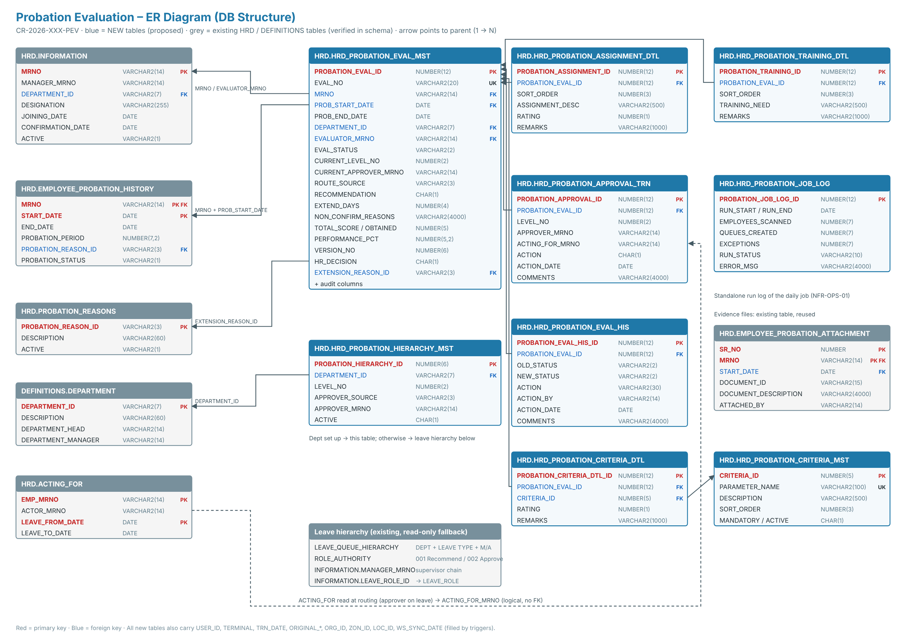

# Design Document: Automated Employee Probation Evaluation

- **CR:** CR-2026-XXX-PEV · **Version:** 0.3 DRAFT (Solution Architect approval pending)
- **Based on:** CR v0.6 and SRS v0.5. **Warning:** the SRS is not yet approved, so this design may change.
- **Schema checked against:** HRD, DEFINITIONS, HIS and PAYROLL DDL exports, including package bodies. APEX applications were not in the export.
- **Approach:** dedicated probation tables plus one new package. Existing HRD objects are reused where they already fit.
- **Changed in v0.3:** approval routing uses the department's probation hierarchy if one is set up. Otherwise it uses the **organizational leave hierarchy** already in HRD, the same rules as `HRD.LEAVE_AUTOMATION.GET_AUTHORITY` (RULE-14).
- **Changed in v0.2:** the evaluation form has four tabs: **Evaluation Criteria | Assignments | Training Needs | Recommendation**.
  - Standard criteria rated 1–5.
  - Assignments completed during probation, each rated 1–5.
  - The employee's assessed training needs.
  - Specific reasons and observations, with evidence, when the employee is not recommended for confirmation.

  The form has no Approval History or Finalization tabs: approval history is on the approval and monitoring pages, and HR finalization is its own page. Evidence is stored in the existing `HRD.EMPLOYEE_PROBATION_ATTACHMENT`.

# 1. Design Summary

- A **daily job** finds employees whose probation ends within 15 days (a setting, default 15) and creates an evaluation for each one's supervisor. This **replaces the Excel form** sent with the probation-ending alert.
- The **supervisor** fills in four tabs, then saves as Draft or submits:
  - **Evaluation Criteria**: standard parameters, each rated 1–5;
  - **Assignments** completed during probation, each rated 1–5;
  - **Training Needs**;
  - **Recommendation**. If the recommendation is Extend or Not to Confirm, the **reasons, observations and evidence** are mandatory.
- On Submit, the evaluation goes through the **approval levels set up for the department**. If none are set up, it goes through the **organizational leave hierarchy**. Each approver can approve it or return it.
- After the last approval it goes to **HR**, who finalize it as Confirm or Extend. Only at this step is the existing probation record updated.
- **Every status change is logged.** HR can see every evaluation on a monitoring screen.

# 2. Key Design Decisions

- **DS-D1 Dedicated tables, not the PA appraisal engine.** The `VU_PA_*` views and `PKG_PERFORMANCE_APPRAISAL` are not affected.
- **DS-D2 Workflow status kept in the new table, not in `EMPLOYEE_PROBATION_HISTORY.PROBATION_STATUS`.** Writing `'C'` to that column fires three triggers:
  - `EMP_INCENTIVE_QUEUE`, which creates incentive/allowance queue entries;
  - `EMP_PROBATION_HISTORY_INFO_UPD`, which sets `INFORMATION.CONFIRMATION_DATE`;
  - `TR_PROBATION_EXPIRE_QUEUE_DEL`, which clears alert 001.

  So `'C'` is written **only at HR finalize**.
- **DS-D3 All logic lives in `HRD.PKG_PROBATION_EVALUATION`.** APEX pages only call package procedures.
- **DS-D4 Queues use the existing pending-task framework:** a new procedure in `HRD.PKG_PENDING_TASKS`, registered in `HIS.USER_ASSIGNMENT`.
- **DS-D5 Optimistic locking:** a `VERSION_NO` column on the header (error -20802 on a mismatch).
- **DS-D6 Approver on leave:** the approval goes to the acting-for person from `HRD.ACTING_FOR`.
- **DS-D10 Routing fallback to the leave hierarchy (RULE-14):**
  - The **probation hierarchy** applies when the department has active rows in `HRD_PROBATION_HIERARCHY_MST`.
  - Otherwise the **leave hierarchy** applies. It is resolved read-only, the way `HRD.LEAVE_AUTOMATION.GET_AUTHORITY` does it:
    1. **Department leave hierarchy:** `HRD.LEAVE_QUEUE_HIERARCHY` for the department, the reference leave type (a setting, Q-29) and hierarchy type M (doctor, from `HIS.PKG_DOCTOR.IS_DOCTOR`) or A (admin). Active rows are taken in `ORDER_BY` order.
    2. **Otherwise the supervisor chain:** start at the evaluator's `MANAGER_MRNO` and move up. Each approver's `INFORMATION.LEAVE_ROLE_ID` is looked up in `ROLE_AUTHORITY` for the reference leave type: authority 001 (Recommend) continues to the next manager; 002 (Approve) is the last level. Safety limit: 6 levels.
  - The route is resolved **once at Submit** and stored as `APPROVAL_TRN` rows, so later hierarchy changes don't move evaluations already in progress.
  - The source is recorded in `EVAL_MST.ROUTE_SOURCE`: PH = probation hierarchy, LQH = department leave hierarchy, SUP = supervisor chain.
  - Leave processing itself is not changed or called; only its setup tables are read.
- **DS-D7 Evidence reuses the existing `HRD.EMPLOYEE_PROBATION_ATTACHMENT`.** It is keyed by `MRNO` + probation `START_DATE`, and no existing package writes to it.
- **DS-D8 Scores are calculated (RULE-13):**
  - total = (number of criteria + number of assignments) × 5;
  - obtained = sum of all ratings;
  - performance % = obtained ÷ total × 100.

  Each tab also shows its own section score.
- **DS-D9 Existing process (alert 001 with the Excel form, and form S07FRM00362):** the e-mail no longer carries the Excel form. Whether the alert is retired or kept for HR monitoring is HR's decision (Q-24).

# 3. DB Structure

**New tables.** All follow the HRD audit-column pattern (`USER_ID`, `TERMINAL`, `TRN_DATE`, `ORIGINAL_*`, `ORG_ID`/`ZON_ID`/`LOC_ID`), filled by triggers.

- **DS-01 `HRD.HRD_PROBATION_EVAL_MST`**: evaluation header, one row per evaluation.
  - **Keys:**
    - `PROBATION_EVAL_ID` NUMBER(12) is the PK.
    - `EVAL_NO` VARCHAR2(20) is unique, in the form `PEV-YYYY-NNNNNN`.
    - `MRNO` VARCHAR2(14) + `PROB_START_DATE` is an FK to `EMPLOYEE_PROBATION_HISTORY`.
  - **Who and where:** `PROB_END_DATE`, `DEPARTMENT_ID` VARCHAR2(7), `EVALUATOR_MRNO` (NULL = HR exception list).
  - **Workflow:** `EVAL_STATUS` VARCHAR2(2) (EP / DR / PA / RT / FH / CM / CN), `CURRENT_LEVEL_NO`, `CURRENT_APPROVER_MRNO`, **`ROUTE_SOURCE`** VARCHAR2(3) (PH / LQH / SUP).
  - **Evaluation:**
    - `RECOMMENDATION` (C = Confirm / E = Extend / N = Not to confirm) and `EXTEND_DAYS`.
    - **`NON_CONFIRM_REASONS` VARCHAR2(4000)**, the specific reasons and observations. Required once submitted when the recommendation is E or N (check constraint `CK_PROB_EVAL_REASONS`).
    - `TOTAL_SCORE`, `OBTAINED_SCORE`, `PERFORMANCE_PCT`, and `SUBMITTED_DATE`.
  - **HR decision:** `HR_DECISION` (C / E / O), `HR_EXTEND_DAYS`, `EXTENSION_REASON_ID` (FK to `PROBATION_REASONS`), `HR_DECISION_BY`, `HR_DECISION_DATE`, `HR_REMARKS`.
  - **Control:** `EXCEPTION_REASON`, and `VERSION_NO` for locking.
  - **One active evaluation per probation period** is enforced by the unique index `IDX_PROB_EVAL_ACTIVE_UK`, which ignores cancelled rows.
- **DS-02a `HRD.HRD_PROBATION_CRITERIA_MST`**: standard evaluation criteria that HR maintains.
  - Columns: `CRITERIA_ID`, `PARAMETER_NAME` VARCHAR2(100), `DESCRIPTION` VARCHAR2(500), `SORT_ORDER`, `MANDATORY` Y/N, `ACTIVE` Y/N.
  - The existing `EVALUATION_CRITERIA_MASTER` is too limited to reuse: its description is only VARCHAR2(55).
- **DS-02b `HRD.HRD_PROBATION_CRITERIA_DTL`**: one rating per criterion per evaluation.
  - Columns: `PROBATION_EVAL_ID`, `CRITERIA_ID`, `RATING` (1–5), `REMARKS`.
  - Unique on (evaluation, criterion). One row per active criterion is created when the evaluation is created.
- **DS-02 `HRD.HRD_PROBATION_ASSIGNMENT_DTL`**: assignments completed during the probationary period.
  - Columns: `PROBATION_ASSIGNMENT_ID`, `PROBATION_EVAL_ID`, `SORT_ORDER`, `ASSIGNMENT_DESC` VARCHAR2(500), `RATING` NUMBER(1) (1–5), `REMARKS` VARCHAR2(1000).
- **DS-03 `HRD.HRD_PROBATION_TRAINING_DTL`**: the employee's assessed training needs.
  - Columns: `PROBATION_TRAINING_ID`, `PROBATION_EVAL_ID`, `SORT_ORDER`, `TRAINING_NEED` VARCHAR2(500), `REMARKS` VARCHAR2(1000).
  - Free text: the training subject master is in the TRAINING schema, which is not in the export. Linking to it is a later option (Q-28).
- **DS-04 `HRD.HRD_PROBATION_HIERARCHY_MST`**: approval levels.
  - Columns: `DEPARTMENT_ID` (**mandatory**; departments without rows use the leave hierarchy), `LEVEL_NO`, `APPROVER_SOURCE`, `APPROVER_MRNO`, `ACTIVE`. Unique on (department, level).
  - `APPROVER_SOURCE` is DH (department head), DM (department manager) or EMP (named employee).
- **DS-05 `HRD.HRD_PROBATION_APPROVAL_TRN`**: one row per level per evaluation.
  - Columns: `LEVEL_NO`, `APPROVER_MRNO`, `ACTING_FOR_MRNO`, `ACTION`, `ACTION_DATE`, `COMMENTS`.
  - `ACTION` is P (pending), A (approved), R (returned) or S (skipped). Comments are mandatory on Return.
- **DS-06 `HRD.HRD_PROBATION_EVAL_HIS`**: status history.
  - Columns: `OLD_STATUS`, `NEW_STATUS`, `ACTION`, `ACTION_BY`, `ACTION_DATE`, `COMMENTS`.
  - Insert-only: trigger `TRG_PROBATION_EVAL_HIS_BUD` blocks updates and deletes.
- **DS-07 `HRD.HRD_PROBATION_JOB_LOG`**: daily job log.
  - Columns: `RUN_START`, `RUN_END`, `EMPLOYEES_SCANNED`, `QUEUES_CREATED`, `EXCEPTIONS`, `CANCELLED`, `RUN_STATUS`, `ERROR_MSG`.
- **DS-08 Supporting objects:**
  - 9 sequences (`PROBATION_*_SEQ`).
  - Indexes on every FK and on the main searches: status, evaluator, approver, end date.
  - Audit triggers `TRG_<TABLE>_BI` / `_BU`, following the existing `EMPLOYEE_PROBATION_HISTORY_INS` pattern.

**Existing objects used.**

- **Read:**
  - `HRD.INFORMATION`: `MRNO`, `MANAGER_MRNO` (evaluator), `DEPARTMENT_ID`, `ACTIVE` H/Y/N.
  - `DEFINITIONS.DEPARTMENT`: `DEPARTMENT_HEAD`, `DEPARTMENT_MANAGER`.
  - `HRD.ACTING_FOR`.
  - `HRD.PROBATION_REASONS`.
  - `HRD.F_PROBATION_END_DATE`, which returns MAX(`END_DATE`).
  - **Leave hierarchy, for the fallback (RULE-14), code-verified in `LEAVE_AUTOMATION`:**
    - `HRD.LEAVE_QUEUE_HIERARCHY` (`DEPARTMENT_ID`, `LEAVE_TYPE_ID`, `HIERARCHY_TYPE`, `ORDER_BY`, `MRNO`, `ACTIVE`);
    - `HRD.ROLE_AUTHORITY` (`LEAVE_ROLE_ID`, `LEAVE_TYPE_ID`, `LEAVE_AUTHORY_ID`);
    - `HRD.LEAVE_ROLE`;
    - `HRD.INFORMATION.LEAVE_ROLE_ID` / `MANAGER_MRNO`;
    - `HIS.PKG_DOCTOR.IS_DOCTOR` and `HRD.F_GET_DEPARTMENT_ID`.
- **Evidence written to `HRD.EMPLOYEE_PROBATION_ATTACHMENT`:**
  - Columns used: `SR_NO`, `MRNO`, `START_DATE` = `PROB_START_DATE`, `DOCUMENT_ID` VARCHAR2(15), `DOCUMENT_DESCRIPTION`, `ATTACHED_BY`, `DOCUMENT_TYPE_ID`.
  - `SR_NO` = MAX + 1 per `MRNO`, under a row lock on the evaluation header.
  - The file itself goes to the existing document store, which is referenced by `DOCUMENT_ID` (the same pattern as `V_HR_EMP_DOCUMENTS`).
- **Written at HR finalize only:** `HRD.EMPLOYEE_PROBATION_HISTORY`.
  - Confirm sets `PROBATION_STATUS = 'C'`.
  - Extend sets a new `END_DATE` and `PROBATION_REASON_ID`, with `PROBATION_STATUS` staying 'P'.
- **Seed data:** `HIS.USER_ASSIGNMENT` (pending-task registration), `HRD.ALERTS` / `ALERT_RECIPIENTS` (notification set-up).

**Data migration:** none. An optional backlog run at go-live creates evaluations for employees who are already within 15 days of their probation end date.

# 4. Technical Details: Package `HRD.PKG_PROBATION_EVALUATION` (NEW)

All procedures use `%TYPE` parameters. The **caller commits** (an APEX page process or the job).

- **`P_GENERATE_EVAL_QUEUE(P_RUN_DATE IN DATE DEFAULT TRUNC(SYSDATE))`**: the daily job. FR-001 to FR-005.
  1. Write a log row (RUNNING).
  2. Do a set-based insert into `EVAL_MST` for active employees on probation where:
     - `F_PROBATION_END_DATE(MRNO)` is between `P_RUN_DATE` and `P_RUN_DATE + lead days` (default 15);
     - and there is no non-cancelled evaluation for that `MRNO` and probation start date.

     This also catches up on missed days.
  3. Set the evaluator from `INFORMATION.MANAGER_MRNO`. If it is NULL, set `EXCEPTION_REASON = 'Supervisor not defined'`.
  4. Insert one `CRITERIA_DTL` row per active criterion, and a history row (action CREATED).
  5. Cancel open evaluations (status EP/DR/PA/RT) for employees whose `INFORMATION.ACTIVE <> 'Y'`.
  6. Queue the notification e-mails, update the log to SUCCESS with counts, and commit. On error: roll back, log FAILED and re-raise.
- **`P_SAVE_DRAFT(P_PROBATION_EVAL_ID, P_VERSION_NO, P_RECOMMENDATION, P_EXTEND_DAYS, P_NON_CONFIRM_REASONS)`**. FR-008.
  - The caller must be the evaluator, and the status must be EP, DR or RT.
  - Sets status DR and writes history. Mandatory fields are not checked.
- **`P_SAVE_CRITERIA_RATING(P_PROBATION_EVAL_ID, P_CRITERIA_ID, P_RATING, P_REMARKS)`**. FR-024.
  - Updates the rating and recalculates the scores (RULE-13).
- **`P_SAVE_ASSIGNMENT(P_PROBATION_EVAL_ID, P_PROBATION_ASSIGNMENT_ID, P_ASSIGNMENT_DESC, P_RATING, P_REMARKS)`** and **`P_DELETE_ASSIGNMENT(P_PROBATION_ASSIGNMENT_ID)`**. FR-021.
  - Insert when the ID is NULL, otherwise update.
  - Recalculates `TOTAL_SCORE`, `OBTAINED_SCORE` and `PERFORMANCE_PCT` (RULE-13).
- **`P_SAVE_TRAINING_NEED(P_PROBATION_EVAL_ID, P_PROBATION_TRAINING_ID, P_TRAINING_NEED, P_REMARKS)`** and **`P_DELETE_TRAINING_NEED(P_PROBATION_TRAINING_ID)`**. FR-022.
- **`P_ADD_EVIDENCE(P_PROBATION_EVAL_ID, P_DOCUMENT_ID, P_DESCRIPTION)`** and **`P_REMOVE_EVIDENCE(P_PROBATION_EVAL_ID, P_SR_NO)`**. FR-023.
  - Insert or delete the row in `HRD.EMPLOYEE_PROBATION_ATTACHMENT` for the evaluation's `MRNO` + `PROB_START_DATE`, with `ATTACHED_BY` = the user.
  - Allowed only while the evaluation is editable (EP, DR or RT).
- **`P_SUBMIT(P_PROBATION_EVAL_ID, P_VERSION_NO)`**. FR-009, FR-010, FR-011, FR-021, FR-023, FR-024, RULE-12.
  1. Check every mandatory criterion is rated, otherwise -20801. Check there is at least one assignment, otherwise -20807.
  2. Check every assignment is rated, otherwise -20801.
  3. Check a recommendation is set, and that Extend has its days, otherwise -20805.
  4. If the recommendation is E or N, check `NON_CONFIRM_REASONS` is filled and at least one evidence row exists, otherwise -20806.
  5. Set `SUBMITTED_DATE`, call `P_BUILD_ROUTE`, then call `P_ROUTE(level 1)`.
- **`P_BUILD_ROUTE(P_PROBATION_EVAL_ID)`** (internal, called by `P_SUBMIT`). FR-011, RULE-14.
  1. Delete any pending (P) route rows left from an earlier submit.
  2. If the department has active `HIERARCHY_MST` rows, resolve each level from DH / DM / EMP and set `ROUTE_SOURCE = 'PH'`.
  3. Otherwise call `F_GET_LEAVE_ROUTE` and set the source to `LQH` or `SUP`.
  4. Insert one `APPROVAL_TRN` row per level with `ACTION = 'P'`.
  5. If no approver is found at all, place the evaluation on the HR exception list ("No approval hierarchy found").
- **`F_GET_LEAVE_ROUTE(P_MRNO, P_EVALUATOR_MRNO, P_ROUTE_SOURCE OUT) RETURN T_APPROVER_LIST`** (internal, read-only). RULE-14.
  - Department leave hierarchy first (`LEAVE_QUEUE_HIERARCHY` by department, reference leave type and M/A type, ordered by `ORDER_BY`).
  - Otherwise the supervisor chain from the evaluator's manager, up to the first approver with `ROLE_AUTHORITY.LEAVE_AUTHORY_ID = '002'`. Maximum 6 levels; cycles are detected.
- **`P_ROUTE(P_PROBATION_EVAL_ID, P_LEVEL_NO)`** (internal). FR-011, FR-014, RULE-09.
  1. Read the next pending `APPROVAL_TRN` row (built by `P_BUILD_ROUTE`).
  2. Use its approver.
  3. If that approver is on leave, use the `HRD.ACTING_FOR` actor.
  4. If the approver is the evaluator or the employee, insert an S (skipped) row and move to the next level.
  5. If the approver cannot be resolved, place the evaluation on the HR exception list.
  6. If there is no next level, set status FH (Forwarded to HR).
  7. Otherwise set status PA, `CURRENT_LEVEL_NO` and `CURRENT_APPROVER_MRNO`, and insert an `APPROVAL_TRN` row with action P.
- **`P_APPROVE(P_PROBATION_EVAL_ID, P_VERSION_NO, P_COMMENTS)`**. FR-012.
  - The caller must be the current approver or the acting-for person.
  - Marks the level A, then calls `P_ROUTE(level + 1)`.
- **`P_RETURN(P_PROBATION_EVAL_ID, P_VERSION_NO, P_COMMENTS)`**. FR-013.
  - Comments are mandatory (-20803).
  - Marks the level R and sets status RT. On re-submit, approval restarts at level 1 (pending Q-07).
- **`P_ASSIGN_EVALUATOR(P_PROBATION_EVAL_ID, P_EVALUATOR_MRNO)`**: HR Administrator only. FR-005, FR-006.
- **`P_HR_FINALIZE(P_PROBATION_EVAL_ID, P_VERSION_NO, P_HR_DECISION, P_HR_EXTEND_DAYS, P_EXTENSION_REASON_ID, P_HR_REMARKS)`**: HR role only, and the status must be FH. FR-015, FR-016, RULE-11.
  - **C (Confirm):** `PROBATION_STATUS = 'C'` on the probation record. The existing triggers then set the confirmation date, queue incentives and clear alert 001.
  - **E (Extend):** `END_DATE = END_DATE + days` and `PROBATION_REASON_ID` (pending Q-08).
  - **O (Other):** no change to the probation record.
  - In all cases: set status CM and write history.
- **`P_LOG_STATUS(...)`** (internal): inserts the `EVAL_HIS` row on every status change.
- **`F_IS_OVERDUE(P_PROBATION_EVAL_ID) RETURN CHAR`**: FR-020.
- **Error codes:**

  | Code | Meaning |
  |---|---|
  | -20800 | Not authorised |
  | -20801 | Unrated criterion or assignment, or mandatory field missing |
  | -20802 | Record changed by another user, reload |
  | -20803 | Comments required for Return |
  | -20804 | Invalid status for this action |
  | -20805 | Recommendation, or extension days/reason, missing |
  | -20806 | Reasons, observations and evidence are required when not recommended for confirmation |
  | -20807 | At least one assignment is required |

**Modified package `HRD.PKG_PENDING_TASKS`:**

- Add `P_PROBATION_EVAL_QUEUE`, with the standard signature (`P_USER_MRNO, P_ACTING_FOR, P_OBJECT_CODE, P_PROCESS_ID, P_TERMINAL, P_EVENT, P_ASSIGNMENT_ID`).
- It inserts the user's item count into `HIS.TMP_USER_ASSIGNMENT_VAL`. The items counted are:
  - as evaluator: status EP, DR or RT;
  - as current approver: status PA;
  - as HR: status FH.
- Register it with one row in `HIS.USER_ASSIGNMENT`.

# 5. GUI Pages (APEX, SKMCH GUI template)

The application ID and page numbers are to be confirmed. Page code `S07APX0XXXX` is a placeholder. Static IDs follow HRD standards (`REG_`, `P<n>_`, `BTN_`, `DA_`, `LOV_`).

- **Page A: My Pending Tasks.** This is the existing inbox, and it lists the new task type. A row click opens Page B.

- **Page B: Probation Evaluation (NEW), Evaluation Criteria tab (first tab).**
  - **Header:** region `REG_EMPLOYEE_INFO` (read-only).
  - **Tabs:** Evaluation Criteria | Assignments | Training Needs | Recommendation.
  - **Criteria grid** `REG_CRITERIA`:
    - Interactive Grid on `HRD_PROBATION_CRITERIA_DTL` joined to `CRITERIA_MST`.
    - Columns: Parameter, Description (read-only), Rating (`LOV_RATING` 1–5), Remarks. Saves call `P_SAVE_CRITERIA_RATING`.
    - The Rating Scale panel and the score bar sit beside and below the grid.
  - **Buttons:** `BTN_PREVIEW`, `BTN_SAVE_DRAFT` (calls `P_SAVE_DRAFT`), `BTN_SUBMIT` (calls `P_SUBMIT`), `BTN_EXIT`.
  - **Validation:** an unrated mandatory parameter is highlighted pink.
  - **Hidden item:** `P<n>_VERSION_NO`.

- **Page B, Assignments tab.**
  - **Assignments grid** `REG_ASSIGNMENTS`:
    - Interactive Grid on `HRD_PROBATION_ASSIGNMENT_DTL`, with columns Assignment, Rating (`LOV_RATING` 1–5) and Remarks.
    - Row add and delete call `P_SAVE_ASSIGNMENT` / `P_DELETE_ASSIGNMENT`.
    - The Rating Scale panel and the score bar sit beside and below the grid.
  - Same buttons as the criteria tab.

- **Page B, Training Needs tab:** Interactive Grid `REG_TRAINING_NEEDS` on `HRD_PROBATION_TRAINING_DTL`, with columns Training Need and Remarks. Calls `P_SAVE_TRAINING_NEED` / `P_DELETE_TRAINING_NEED`.

- **Page B, Recommendation tab:**
  - Radio `P<n>_RECOMMENDATION` (C / E / N).
  - `P<n>_EXTEND_DAYS`, shown only for Extend.
  - **`P<n>_NON_CONFIRM_REASONS`** (textarea) and the **Evidence** region `REG_EVIDENCE`. The evidence report lists `EMPLOYEE_PROBATION_ATTACHMENT` rows; "Attach Evidence" calls `P_ADD_EVIDENCE` and "Remove" calls `P_REMOVE_EVIDENCE`.
  - `DA_TOGGLE_REASONS` shows and marks the reasons and evidence as required when the recommendation is E or N.

- **Page C: Approval (NEW).**
  - Routing bar showing the evaluator and each level with its status, plus the **route source** (department probation hierarchy or leave hierarchy).
  - The four form tabs shown read-only (criteria, assignments, training needs, reasons and evidence), plus the approver comments.
  - `BTN_APPROVE` calls `P_APPROVE`; `BTN_RETURN` calls `P_RETURN`.
  - **Authorization:** the current approver or acting-for person only.

- **Page D: Probation Approval Hierarchy Setup (NEW).** Interactive Grid on `HRD_PROBATION_HIERARCHY_MST`; the department is mandatory. A note explains that departments without rows follow the organizational leave hierarchy. **Authorization:** HR Administrator.

- **Page E: HR queue (NEW).** Report of evaluations with status FH, showing recommendation, final approver, performance % and evidence count. "Process" opens Page F.

- **Page F: HR Finalization (NEW, a separate page, not a tab).**
  - Shows the routing bar, the overall score, the recommendation, the reasons and the training needs.
  - Decision radio, extension days and reason (`LOV_PROBATION_REASONS`), remarks.
  - `BTN_FINALIZE` calls `P_HR_FINALIZE`.
  - **Authorization:** HR User.

- **Page G: Probation Monitoring (NEW).**
  - Filters, an evaluation grid with Overdue and No-supervisor flags, "Assign Evaluator", and the status-history report.
  - **Authorization:** HR User; assigning needs HR Administrator.

# 6. Jobs, Notifications and Security

- **Job `HRD.JOB_PROBATION_EVAL_QUEUE`** (DBMS_SCHEDULER):
  - Runs daily at 02:00 and calls `P_GENERATE_EVAL_QUEUE`.
  - A failed run is logged and IT support is alerted.
- **Notification e-mails:**
  - Sent for: evaluation assigned, pending approval, returned, and forwarded to HR.
  - They use `APEX_MAIL`, configured through `HRD.ALERTS` / `ALERT_RECIPIENTS`. **No Excel attachment:** the e-mail links to the online form (Q-27 asks IT for the mail API).
- **Authorization schemes:**
  - `AUTH_PROB_EVALUATOR`;
  - `AUTH_PROB_APPROVER` (the current approver or acting-for person);
  - `AUTH_PROB_HR_USER` and `AUTH_PROB_HR_ADMIN` (security groups, to be confirmed by IT).
- **Data access:** all reads and writes go through the package's role checks. Evidence is visible only to the evaluator, the approvers in the routing path, and HR.
- **Audit:** audit columns on every table, the insert-only history, and no physical delete of evaluations (cancel sets status CN).
- **Privacy:** `MRNO` is also the patient MR number. The pages do not join or link to `REGISTRATION` data.

# 7. Requirement Coverage

- **FR-001, FR-002, FR-003, FR-004, FR-005, FR-006** (queue generation, duplicates, cancel, exceptions, reassign): DS-01, DS-07, `P_GENERATE_EVAL_QUEUE`, `P_ASSIGN_EVALUATOR`, Page G.
- **FR-007, FR-008, FR-009, FR-010** (form, Draft, Submit, lock): DS-01, `P_SAVE_DRAFT`, `P_SUBMIT`, Page B.
- **FR-024** (standard criteria rated 1–5): DS-02a, DS-02b, `P_SAVE_CRITERIA_RATING`, Page B Evaluation Criteria tab.
- **FR-021** (assignments rated 1–5): DS-02, `P_SAVE_ASSIGNMENT`, score calculation, Page B Assignments tab.
- **FR-022** (assessed training needs): DS-03, `P_SAVE_TRAINING_NEED`, Page B Training Needs tab.
- **FR-023** (reasons, observations and evidence when not recommended): `NON_CONFIRM_REASONS`, `EMPLOYEE_PROBATION_ATTACHMENT`, `P_ADD_EVIDENCE`, the `P_SUBMIT` check, Page B Recommendation tab.
- **FR-011, FR-012, FR-013, FR-014** (routing with leave-hierarchy fallback, approve, return, no self-approval): DS-04, DS-05, DS-D10, `P_BUILD_ROUTE`, `F_GET_LEAVE_ROUTE`, `P_ROUTE`, `P_APPROVE`, `P_RETURN`, Pages C and D.
- **FR-015, FR-016** (forward to HR, finalize): `P_ROUTE` (status FH), `P_HR_FINALIZE`, Pages E and F.
- **FR-017, FR-018, FR-019, FR-020** (status, history, monitoring, overdue): DS-06, `P_LOG_STATUS`, `F_IS_OVERDUE`, Page G.
- **NFR-SEC-01, NFR-SEC-02:** authorization schemes, plus role checks inside the package.
- **NFR-AUD-01, NFR-AUD-02:** audit triggers, plus the insert-only history.
- **NFR-PERF-01, NFR-PERF-02:** set-based job SQL, plus indexes.
- **NFR-AVL-01:** the job's date window catches up on missed days. **NFR-AVL-02:** new objects only; no downtime.
- **NFR-DAT-01:** no physical delete. **NFR-DAT-02:** unique index. **NFR-DAT-03:** `VERSION_NO` with error -20802.
- **NFR-USA-01, NFR-USA-02:** APEX pages in the SKMCH GUI template, plus the "warn on unsaved changes" setting.
- **NFR-CMP-01:** status rules agreed with HR. **NFR-INT-01:** employee data read live from `INFORMATION`.
- **NFR-OPS-01:** job log and failure alert. **NFR-OPS-02:** non-blocking notification e-mails.

# 8. Change Inventory and Deployment

- **Scripts, run in this order** (no downtime):

  | Step | Script | What it does |
  |---|---|---|
  | 0 | `CR-2026-XXX-PEV_00_precheck.sql` | Checks that no `HRD_PROBATION_%` objects exist, and backs up the `PKG_PENDING_TASKS` source |
  | 1 | `CR-2026-XXX-PEV_01_ddl.sql` | Sequences, 9 new tables, indexes, triggers (provided) |
  | 2 | `CR-2026-XXX-PEV_02_pkg_probation_evaluation.pks` / `.pkb` | New package |
  | 3 | `CR-2026-XXX-PEV_03_pkg_pending_tasks.pkb` | Adds `P_PROBATION_EVAL_QUEUE` |
  | 4 | `CR-2026-XXX-PEV_04_seed.sql` | Evaluation criteria from HR's form, department hierarchies (where HR wants them), the reference leave type setting, the `HIS.USER_ASSIGNMENT` row, alert rows, and the lead-days setting (default 15) |
  | 5 | `CR-2026-XXX-PEV_05_job.sql` | Creates the scheduler job |
  | 6 | APEX export | Pages B–G, authorization schemes, LOVs |

- **After deployment, verify:** all objects are VALID; a manual run of the job creates evaluations and a SUCCESS log row; the inbox shows the task count; on a test record, a Submit with E and no evidence is refused (-20806).
- **Rollback:** `CR-2026-XXX-PEV_99_rollback.sql` (provided). It does not revert finalized probation records or the evidence rows stored in `EMPLOYEE_PROBATION_ATTACHMENT`; those are business records.
- **Retest these dependents:**
  - readers of `EMPLOYEE_PROBATION_HISTORY`: `PKG_COMMON`, `PKG_EMPLOYEE_INFO`, `PKG_EMP_INCENTIVE`, `PKG_HR_ALERTS`, `PKG_HR_DOCUMENT_RECORD`, `PKG_HR_EMPLOYEE_RECORD`, `LEAVE_AUTOMATION`, `EMAILS`, `V_HR_EMP_DOCUMENTS`;
  - any HR document screen that lists `EMPLOYEE_PROBATION_ATTACHMENT`;
  - leave approval itself (regression only, to confirm it is unaffected, since `LEAVE_QUEUE_HIERARCHY` and `ROLE_AUTHORITY` are only read).

# 9. Risks and Open Questions

- **Risk: probation status written too early.** Mitigation: only `P_HR_FINALIZE` writes it.
- **Risk: duplicate channels (Excel alert 001 and S07FRM00362).** HR decides before go-live (Q-24).
- **Risk: stale `MANAGER_MRNO`.** Mitigation: HR exception list and a data-quality report.
- **Open questions:**
  - **Q-07 (HR):** after a Return, does approval restart at level 1?
  - **Q-08 (HR):** for an extension, extend the current probation period or add a new one?
  - **Q-16 (HR):** which departments get their own probation hierarchy, and their levels. All other departments use the leave hierarchy.
  - **Q-29 (HR/IT):** which leave type's hierarchy to use for the fallback (proposed: annual/earned leave).
  - **Q-30 (HR):** in the supervisor-chain fallback, does level 1 start at the evaluator's manager, and does it stop at the first leave approver (authority 002)?
  - **Q-24 (HR):** retire the Excel alert 001 and S07FRM00362, or keep them for HR monitoring? Should the lead time be 15 or 30 days?
  - **Q-27 (IT):** mail API and sender; security groups for the HR roles; the `DOCUMENT_TYPE_ID` to use for evidence.
  - **Q-28 (HR):** should training needs link to the training-subject master (TRAINING schema), or stay as free text?
